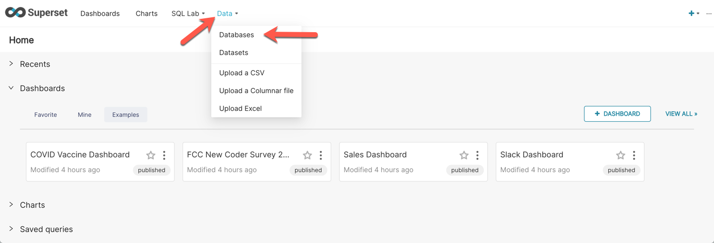
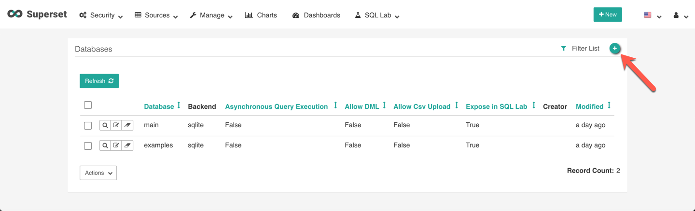
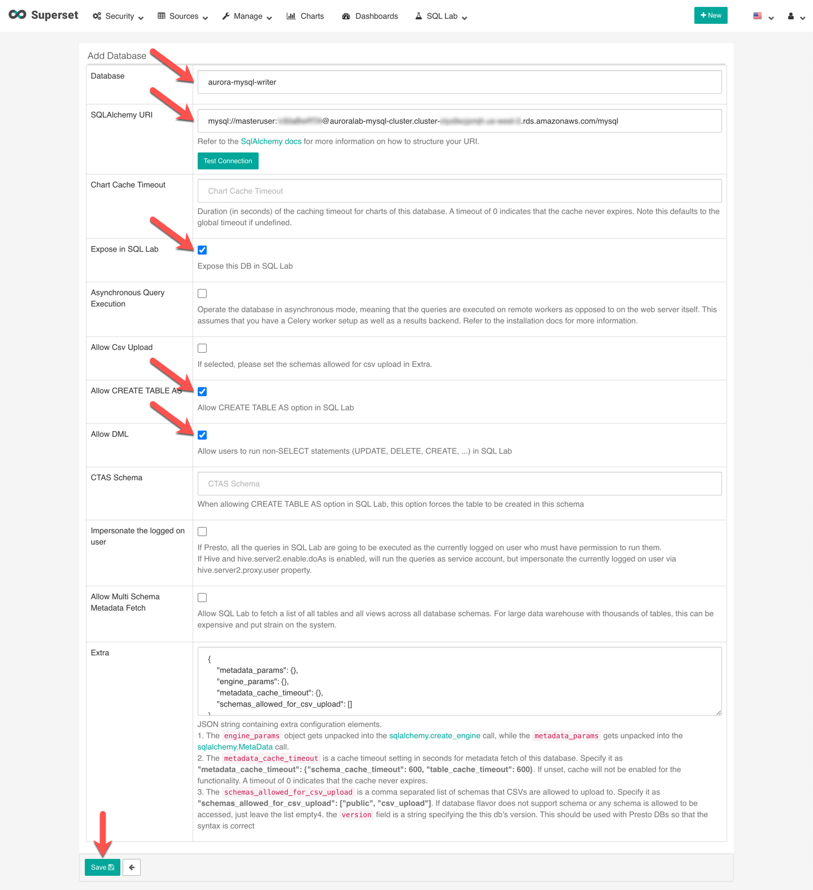
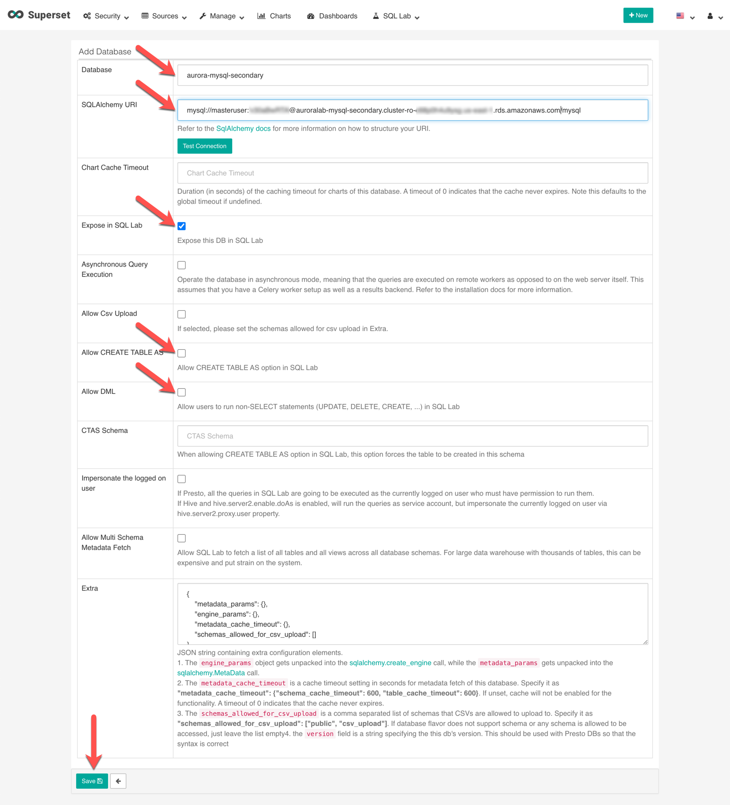
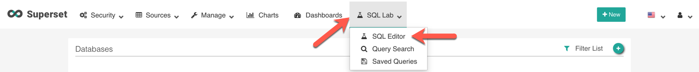

# Connect an Application to Aurora Global Database

Amazon Aurora provides both MySQL and PostgreSQL compatible database engines. This means any existing applications that work with MySQL and PostgreSQL will have drop-in compatibility with Amazon Aurora. In this lab, you will configure a business intelligence (BI) application operating in each of the two regions, and connect it to the respective local DB Cluster reader endpoint of the Aurora Global Database, in order to achieve lower query latency.

For the purpose of this workshop, you will be using <a href="https://superset.incubator.apache.org/" target="_blank">Apache Superset</a> as the application. Superset is an open source, business intelligence and data exploration platform designed to be visual, intuitive and interactive.

This lab contains the following tasks:

1. Gather the needed information
2. Configure application in primary region
3. Configure application in secondary region
4. Access data using the application

This lab requires the following prerequisites:

* [Get Started](/prereqs/environment/) (choose the **Deploy Global DB** option)
* [Deploy an Aurora Global Database](/global/deploy/)


## 1. Gather the needed information

Apache Superset has already been installed in your lab environment, but you will need to retrieve the URL of the Superset web application, and the username and password. You will need to retrieve these details for both the primary and secondary regions. Similarly, you need to retrieve the DB cluster endpoints for both the primary and secondary DB clusters, as well as the database access credentials.

This table provides an overview of where you can find this information, with detailed steps below:

Parameter | Location in Primary Region | Location in Secondary Region
----- | ----- | -----
Superset URL | CloudFormation stack outputs or Event Engine Team Dashboard | CloudFormation stack outputs
Superset username and password | CloudFormation stack outputs or Event Engine Team Dashboard | *same as in primary region*
Aurora **cluster** endpoint | CloudFormation stack outputs or Event Engine Team Dashboard | *not available in secondary region*
Aurora **reader** endpoint | CloudFormation stack outputs or Event Engine Team Dashboard | RDS service console
Aurora DB credentials | AWS Secrets Manager secret | *same as in primary region*

In the **primary region**, open the <a href="https://console.aws.amazon.com/cloudformation/home#/stacks" target="_blank">Amazon CloudFormation service console</a>. Click on the stack named either `auroralab` or starting with `mod-`. 

!!! warning "Region Check"
    Ensure you are still working in the **primary region**, especially if you are following the links above to open the service console at the right screen.

<span class="image"></span>

Change to the **Outputs** tab, and find the values for the parameters, and make a note of them:

* supersetURL
* supersetUsername
* supersetPassword
* clusterEndpoint
* readerEndpoint

<span class="image"></span>

!!! note
    If these values are not present, you may not have selected the correct region, or the lab environment was not initialized with the Global Database feature enabled. If you are participating in an organized event (e.g. workshop), please reach out to a lab assistant for help.

Next, also in the **primary region**, open the <a href="https://console.aws.amazon.com/secretsmanager/home#/listSecrets" target="_blank">AWS Secrets Manager service console</a>. Click on the secret named starting with `secretClusterAdminUser-`.

!!! warning "Region Check"
    Ensure you are still working in the **primary region**, especially if you are following the links above to open the service console at the right screen.

<span class="image"></span>

Scroll down to the **Secret value** section, and click **Retrieve secret value**. Note down the values for **username** and **password**.

<span class="image"></span>

You have now collected all the needed parameters for the primary region. Next you will be collecting the needed parameters for the **secondary region**.

In the **secondary region**, open the <a href="https://console.aws.amazon.com/cloudformation/home?region=us-east-1#/stacks" target="_blank">Amazon CloudFormation service console</a>. Click on the stack named either `auroralab` or starting with `mod-`. 

!!! warning "Region Check"
    Ensure you are still working in the **secondary region**, especially if you are following the links above to open the service console at the right screen.

<span class="image"></span>

Change to the **Outputs** tab, and find the values for the parameters, and make a note of them:

* supersetURL
* supersetUsername
* supersetPassword

<span class="image"></span>

!!! note
    The username and password for the Apache Superset application should be the same in both the primary and secondary region, but the application URL endpoints are different. 

In the **secondary region**, open the <a href="https://console.aws.amazon.com/rds/home?region=us-east-1#database:id=auroralab-mysql-secondary;is-cluster=true" target="_blank">Amazon RDS service console</a> at the MySQL DB cluster details page of the **secondary DB cluster**. 

!!! warning "Region Check"
    Ensure you are still working in the **primary region**, especially if you are following the links above to open the service console at the right screen.

If not already selected, click on the **Connectivity and security** tab, and note down the value of the **Reader Endpoint**. Verify that it is in an `Available` status.

<span class="image"></span>

!!! note
    The **Writer** (cluster) endpoint is also displayed, but is marked in `Creating` or `Inactive` state. This is normal, the cluster endpoint will only be activated when a secondary region is promoted to a stand-alone DB cluster.

At this point you have collected all the information needed for both the **primary** and **secondary regions**, and you can continue configuring the application.


## 2. Configure application in primary region

Open a new browser tab or window. Apache Superset is a web-based application running on an EC2 instance in the **primary region**, simply paste the ==[supersetURL]== value from the **primary region** into your address bar. The URL will have the following format:

```text
http://ec2-XXX-XXX-XXX-XXX.<xx-region-x>.compute.amazonaws.com/
```

You should see the login page for Apache Superset. Type in the values of ==[supersetUsername]==  and ==[supersetPassword]== in the **Username** and **Password** fields respectively.

<span class="image"></span>

Next, you will create a new datasource for Apache Superset in order to connect to the Aurora Global Database cluster. In the Apache Superset navigation menu (top bar), mouse over **Sources**, then click on **Databases**.

<span class="image"></span>

Near the top right, click on the green **+** icon to add a new database source.

<span class="image"></span>

Provide the following values in the relevant form fields to add the data source, then click **Save**:

Field | Value | Description
----- | ----- | -----
Database | `aurora-mysql-writer` | This will be the friendly name of our Aurora Database in Superset.
SQLAlchemy URI | `mysql://[username]:[password]@[cluster_endpoint]/mysql` | Replace ==[username]== and ==[password]== with the Aurora DB credentials retrieved before from the secet. Replace ==[cluster_endpoint]== with the Aurora DB **cluster endpoint**  retrieved previously (in the primary region). Click on **Test Connection** to confirm the settings are correct.
Expose in SQL Lab | &#9745; | Make sure this option is **checked**.
Allow CREATE TABLE AS | &#9745; | Make sure this option is **checked**.
Allow DML | &#9745; | Make sure this option is **checked**.

<span class="image"></span>


## 2. Configure application in secondary region

The secondary region setup will be very similar. Open a new browser tab or window. Apache Superset is a web-based application that is also running on an EC2 instance in the **secondary region**, simply paste the ==[supersetURL]== value from the **secondary region** into your address bar. The URL will have the following format:

```text
http://ec2-XXX-XXX-XXX-XXX.<xx-region-x>.compute.amazonaws.com/
```

You should see the login page for Apache Superset. Type in the values of ==[supersetUsername]==  and ==[supersetPassword]== in the **Username** and **Password** fields respectively. These credentails are the same as in the primary region.

<span class="image"></span>

Next, you will create a new datasource for Apache Superset in order to connect to the Aurora Global Database cluster. In the Apache Superset navigation menu (top bar), mouse over **Sources**, then click on **Databases**.

<span class="image"></span>

Near the top right, click on the green **+** icon to add a new database source.

<span class="image"></span>

Provide the following values in the relevant form fields to add the data source, then click **Save**:

Field | Value | Description
----- | ----- | -----
Database | `aurora-mysql-secondary` | This will be the friendly name of our Aurora Database in Superset.
SQLAlchemy URI | `mysql://[username]:[password]@[reader_endpoint]/mysql` | Replace ==[username]== and ==[password]== with the Aurora DB credentials retrieved before from the secet. Replace ==[reader_endpoint]== with the Aurora DB **reader endpoint**  retrieved previously foir the **secondary region**. Click on **Test Connection** to confirm the settings are correct.
Expose in SQL Lab | &#9745; | Make sure this option is **checked**.
Allow CREATE TABLE AS | &#9744; | Make sure this option is **not checked**.
Allow DML | &#9744; | Make sure this option is **not checked**.

<span class="image"></span>

## 4. Access data using the application

If you no longer have a browser window or tab open for Apache Superset in the **primary region**, go ahead and log back in again, using the same steps as described above at **2. Configure application in primary region**.

In the Apache Superset navigation menu, mouse over **SQL Lab**, then click on **SQL Editor**.

<span class="image"></span>

In the web-based IDE within Superset that displays, on the left menu, select `mysql aurora-mysql-writer`, for **Database** and then select `mylab` for **Schema**.

Copy and paste the following SQL query in the editor and then click on **Run Query**.

```sql
DROP TABLE IF EXISTS gdbtest1;
DROP PROCEDURE IF EXISTS InsertRand;

CREATE TABLE gdbtest1 (
  pk INT NOT NULL AUTO_INCREMENT,
  gen_number INT NOT NULL,
  PRIMARY KEY (pk)
  );

CREATE PROCEDURE InsertRand(IN NumRows INT, IN MinVal INT, IN MaxVal INT)
  BEGIN
     DECLARE i INT;
     SET i = 1;
     START TRANSACTION;
     WHILE i <= NumRows DO
           INSERT INTO gdbtest1 (gen_number) VALUES (MinVal + CEIL(RAND() * (MaxVal - MinVal)));
           SET i = i + 1;
     END WHILE;
     COMMIT;
  END;

CALL InsertRand(1000000, 1357, 9753);

SELECT count(pk), sum(gen_number), md5(avg(gen_number)) FROM gdbtest1;
```

<span class="image"></span>

This may take about 30 seconds to complete. It is okay if you see the `Offline` indicator before receiving the query results. This SQL creates a new table and randomly inserts 1 million records into the Global Database. Note the results down in a notepad or leave the browser window open.

Next, if you no longer have a browser window or tab open for Apache Superset in the **secondary region**, go ahead and log back in again, using the same steps as described above at **3. Configure application in secondary region**

Similarly, in the Apache Superset navigation menu, mouse over **SQL Lab**, then click on **SQL Editor**.

In the web-based IDE within Superset, on the left menu, select `aurora-mysql-secondary`, for **Database** and then select `mylab` for **Schema**.

Copy and paste in the following SQL query and then click on **Run Query**.

```sql
SELECT count(pk), sum(gen_number), md5(avg(gen_number)) FROM gdbtest1;
```  
    
<span class="image"></span>

Note the results, the fields should match exactly the same as the previous results in the primary instance. This includes the count of records, sum of randomly generated values, and the md5 hash of the average of the generated values.

This illustrates the way you can interact with the various regional components of an Aurora Global Database and how data is replicated from the primary DB cluster to secondary DB clusters.