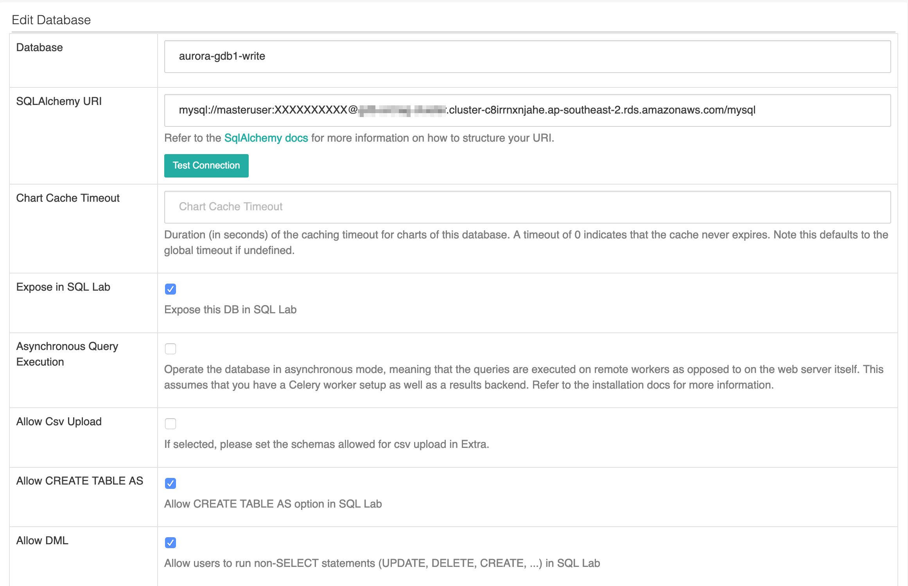
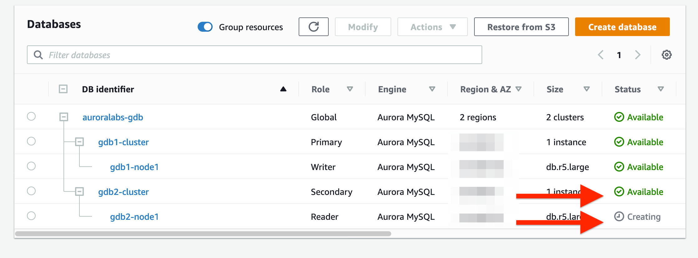
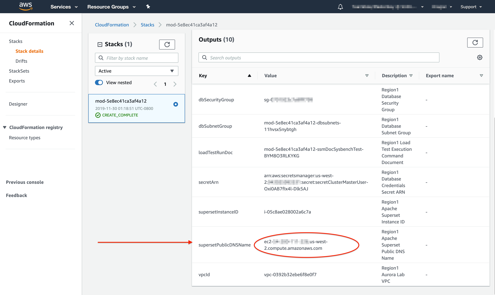
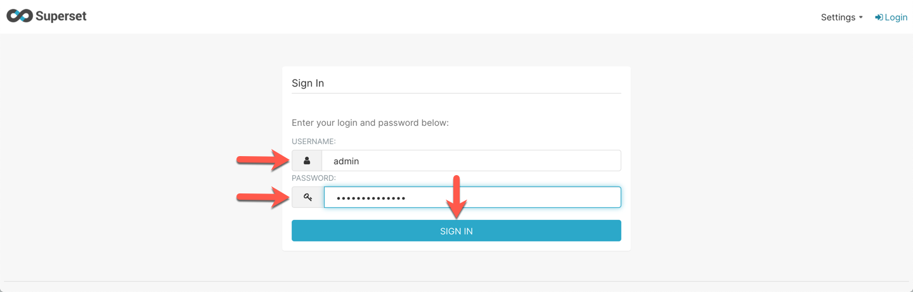
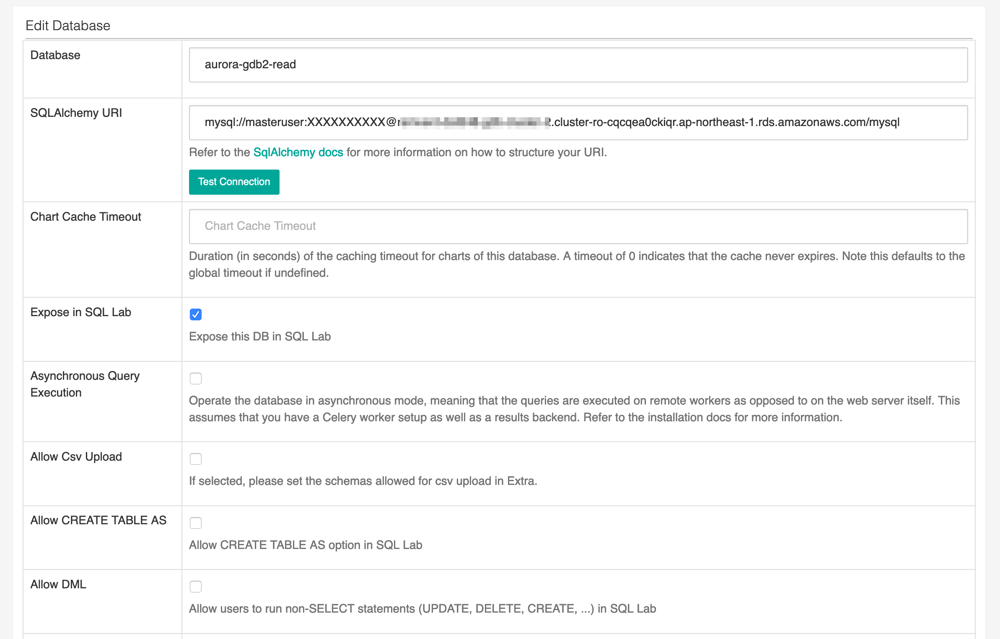
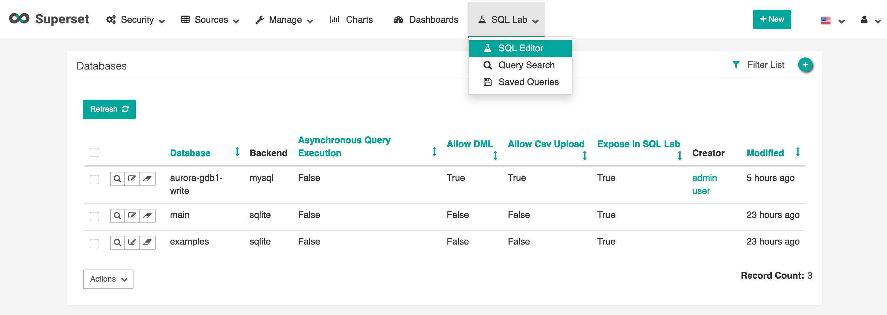

# Connect an Application to Aurora Global Database

Amazon Aurora provides both MySQL and PostgreSQL compatible database engines. This means any existing applications that work with MySQL and PostgreSQL will have drop-in compatibility with Amazon Aurora. In this lab, you will configure a business intelligence (BI) application operating in each of the two regions, and connect it to the respective local DB Cluster reader endpoint of the Aurora Global Database, in order to achieve lower query latency.

For the purpose of this workshop, you will be using <a href="https://superset.incubator.apache.org/" target="_blank">Apache Superset</a> as the application. Superset is an open source, business intelligence and data exploration platform designed to be visual, intuitive and interactive.

This lab contains the following tasks:

1. Gather the needed information
2. Configure application in primary region
3. Configure application in secondary region
4. Access data using the application

This lab requires the following prerequisites:

* [Get Started](/prereqs/environment/) (you do not need to provision a DB cluster automatically)
* [Connect to the Session Manager Workstation](/prereqs/connect/)
* [Deploy an Aurora Global Database](/global/deploy/)


## 1. Gather the needed information

Apache Superset has already been installed in your lab environment, but you will need to retrieve the URL of the Superset web application, and the username and password. You will need to retrieve these details for both the primary and secondary regions. Similarly, you need to retrieve the DB cluster endpoints for both the primary and secondary DB clusters, as well as the database access credentials.

This table provides an overview of where you can find this information, with detailed steps below:

Parameter | Location in Primary Region | Location in Secondary Region
----- | ----- | -----
Superset URL | CloudFormation stack outputs or Event Engine Team Dashboard | CloudFormation stack outputs
Superset username and password | CloudFormation stack outputs or Event Engine Team Dashboard | *same as in primary region*
Aurora **cluster** endpoint | CloudFormation stack outputs or Event Engine Team Dashboard | *not available in secondary region*
Aurora **reader** endpoint | CloudFormation stack outputs or Event Engine Team Dashboard | RDS service console
Aurora DB credentials | AWS Secrets Manager secret | *same as in primary region*

In the **primary region**, open the <a href="https://us-west-2.console.aws.amazon.com/cloudformation/home?region=us-west-2#/stacks" target="_blank">Amazon CloudFormation service console</a>. Click on the stack named either `auroralab` or starting with `mod-`. 

<span class="image"></span>

Change to the **Outputs** tab, and find the values for the parameters, and make a note of them:

* supersetURL
* supersetUsername
* supersetPassword
* clusterEndpoint
* readerEndpoint

<span class="image"></span>

!!! note
    If these values are not present, you may not have selected the correct region, or the lab environment was not initialized with the Global Database feature enabled. If you are participating in an organized event (e.g. workshop), please reach out to a lab assistant for help.

Next, also in the **primary region**, open the <a href="https://us-west-2.console.aws.amazon.com/secretsmanager/home?region=us-west-2#/listSecrets" target="_blank">AWS Secrets Manager service console</a>. Click on the secret named starting with `secretClusterMasterUser-`.

<span class="image"></span>

Scroll down to the **Secret value** section, and click **Retrieve secret value**. Note down the values for **username** and **password**.

<span class="image"></span>

You have now collected all the needed parameters for the primary region. Next you will be collecting the needed parameters for the **secondary region**.

In the **secondary region**, open the <a href="https://console.aws.amazon.com/cloudformation/home?region=us-east-1#/stacks" target="_blank">Amazon CloudFormation service console</a>. Click on the stack named either `auroralab` or starting with `mod-`. 

<span class="image"></span>

Change to the **Outputs** tab, and find the values for the parameters, and make a note of them:

* supersetURL
* supersetUsername
* supersetPassword

<span class="image"></span>

!!! note
    The username and password for the Apache Superset application should be the same in both the primary and secondary region, but the application URL endpoints are different. 

In the **secondary region**, open the <a href="https://console.aws.amazon.com/rds/home?region=us-east-1#database:id=auroralab-mysql-secondary;is-cluster=true" target="_blank">Amazon RDS service console</a> at the MySQL DB cluster details page of the **secondary DB cluster**. 

If not already selected, click on the **Connectivity and security** tab, and note down the value of the **Reader Endpoint**. Verify that it is in an `Available` status.

<span class="image"></span>

!!! note
    The **Writer** (cluster) endpoint is also displayed, but is marked in `Creating` state. This is normal, the cluster endpoint will only be activated when a secondary region is promoted to a stand-alone DB cluster.

At this point you have collected all the information eeded for both the **primary** and **secondary regions**, and you can continue configuring the application.


## 2. Configure application in primary region

Open a new browser tab or window. Apache Superset is a web-based application running on an EC2 instance in the **primary region**, simply paste the ==[supersetURL]== value from the **primary region** into your address bar. The URL will have the following format:

```text
http://ec2-XXX-XXX-XXX-XXX.<xx-region-x>.compute.amazonaws.com/
```

You should see the login page for Apache Superset. Type in the values of ==[supersetUsername]==  and ==[supersetPassword]== in the **Username** and **Password** fields respectively.

<span class="image"></span>

Next, you will create a new datasource for Apache Superset in order to connect to the Aurora Global Database cluster. In the Apache Superset navigation menu (top bar), mouse over **Sources**, then click on **Databases**.

<span class="image"></span>

Near the top right, click on the green **+** icon to add a new database source.

<span class="image"></span>

Provide the following values in the relevant form fields to add the data source, then click **Save**:

Field | Value | Description
----- | ----- | -----
Database | `aurora-mysql-writer` | This will be the friendly name of our Aurora Database in Superset


SQLAlchemy URI | <pre>mysql://masteruser:<b>auroragdb321</b>@<b><i>[Replace with Master Writer Endpoint]</i></b>/mysql</pre> <br> Replace the endpoint with the Primary Writer Endpoint we have gathered previously. The password to connect to the database should remain as ```auroragdb321``` unless you have changed this value during CloudFormation deployment. Click on **Test Connection** to confirm.<br>&nbsp;
Expose in SQL Lab | &#9745; (Checked)
Allow CREATE TABLE AS | &#9745; (Checked)
Allow DML | &#9745; (Checked)

<span class="image"></span>


## 3. Configure application in secondary region

The secondary region setup will be very similar.

>  **`Region 2 (Secondary)`**

* Open <a href="https://console.aws.amazon.com/rds" target="_blank">RDS</a> in the AWS Management Console. Ensure you are in your assigned region. Verify that the secondary region Aurora DB cluster and DB instance -- which we named ``gdb2-cluster`` and ``gdb2-node1`` -- have been created successfully and their status shows available to connect. If either still shows as *Creating*, refresh this page and proceed to the next step when both show *Available*.

  <span class="image"></span>

* Open <a href="https://console.aws.amazon.com/cloudformation" target="_blank">CloudFormation</a> in the AWS Management Console. Ensure you are in your assigned region.

* Click on **Stacks**, and select the workshop stack that was originally deployed for this particular region. Click on the **Outputs** tab.

* Locate the value for the output key ``=[supersetPublicDNSName]=``, and copy the value, this value should be similar to

    ```
    ec2-12-34-56-78.<xx-region-x>.compute.amazonaws.com
    ```
    
   (Your outputs will be different in value)

* Open a new browser tab or window. Since Apache Superset is being served by the EC2 instance via a HTTP server application on port 80, simply paste the DNS name value into your address bar, Your browser address bar should resemble the following URL format:

    ```
    http://ec2-12-34-56-78.<xx-region-x>.compute.amazonaws.com
    ```

* You should see the login page for Superset. Type in ```admin``` for **Username** and the default password ```auroragdb321``` as the application **Password** (unless you have changed this value during CloudFormation deployment).

    <span class="image"></span>

* If login is successful, you will then be taken to the Superset main dashboard.

* Apache Superset has a number of local sample data installed on the EC2 instance. However we will not be using them for the workshop. Let's create a new datasource for Apache Superset, our Aurora Global Database. Note that we will not be allowing DML queries because the secondary region is serving read-only traffic.

   1. In the Apache Superset navigation menu, mouse over **Sources**, then click on **Databases**.
      <span class="image"></span>

   1. Near the top right, click on the green **+** icon to add a new database source.

   1. Change the below values and press **Save** when done:

      Field | Value and Description
      ----- | -----
      Database | <pre>aurora-gdb2-read</pre> <br> This will be the friendly name of our Aurora Database in Superset<br>&nbsp;
      SQLAlchemy URI | <pre>mysql://masteruser:<b>auroragdb321</b>@<b><i>[Replace with Secondary Reader Endpoint]</i></b>/mysql</pre> <br> Replace the endpoint with the Secondary Reader Endpoint we have gathered previously. The endpoint should have the text <b>cluster-ro</b> within it in order to differentiate from the writer endpoint. The password to connect to the database should remain as ```auroragdb321``` unless you have changed this value during CloudFormation deployment. Click on **Test Connection** to confirm.<br>&nbsp;
      Expose in SQL Lab | &#9745; (Checked)
      Allow CREATE TABLE AS | &#9744; (Unchecked)
      Allow DML | &#9744; (Unchecked)

      

### Checkpoint 1

At this point, you should have the 2 BI application instances, launched in 2 distinct regions, connected to their respective endpoints of the Global Database cluster reader and writer endpoints. Let's recap and ensure we have gathered the follow data (use a notepad application of your choice) and copy down the following before we proceed.

> **`Region 1 (Primary)`**

* **Apache Superset Primary URL**: ```http://ec2-12-34-56-78.<xx-region-x>.compute.amazonaws.com```
* **Aurora Cluster Primary Writer Endpoint**: ```gdb1-cluster.cluster-abcdefghijk.xx-region-X.rds.amazonaws.com```

> **`Region 2 (Secondary)`**

* **Apache Superset Secondary URL**: ```http://ec2-12-34-56-78.<xx-region-x>.compute.amazonaws.com```
* **Aurora Cluster Secondary Reader Endpoint**: ```gdb2-cluster.cluster-ro-abcdefghijk.xx-region-X.rds.amazonaws.com```
* **Aurora Cluster Secondary Writer Endpoint (for failover)**: ```gdb2-cluster.cluster-abcdefghijk.xx-region-X.rds.amazonaws.com```


## 4. Access data using the application

>  **`Region 1 (Primary)`**

* Log in to the Primary Region instance of Apache Superset. Use the **Apache Superset Primary URL** from Checkpoint 1 above.

* In the Apache Superset navigation menu, mouse over **SQL Lab**, then click on **SQL Editor**.
    <span class="image"></span>

* This opens up a web-based IDE within Superset. On the left menu, select ``mysql aurora-gdb1-write``, for **Database** and then select ``mylab`` for **Schema**.
    <span class="image"></span>

* Copy and paste in the following SQL query and then click on **Run Query**.

```
DROP TABLE IF EXISTS gdbtest1;
DROP PROCEDURE IF EXISTS InsertRand;

CREATE TABLE gdbtest1 (
  pk INT NOT NULL AUTO_INCREMENT,
  gen_number INT NOT NULL,
  PRIMARY KEY (pk)
  );

CREATE PROCEDURE InsertRand(IN NumRows INT, IN MinVal INT, IN MaxVal INT)
  BEGIN
     DECLARE i INT;
     SET i = 1;
     START TRANSACTION;
     WHILE i <= NumRows DO
           INSERT INTO gdbtest1 (gen_number) VALUES (MinVal + CEIL(RAND() * (MaxVal - MinVal)));
           SET i = i + 1;
     END WHILE;
     COMMIT;
  END;

CALL InsertRand(1000000, 1357, 9753);

SELECT count(pk), sum(gen_number), md5(avg(gen_number)) FROM gdbtest1;
```

* This may take about 30 seconds to complete. It is okay if you see the Offline indicator before receiving the query results.

* This SQL creates a new table and randomly inserts 1 million records into the Global Database. Note the results in a notepad or leave the browser window open.

>  **`Region 2 (Secondary)`**

*  Log in to the Secondary Region instance of Apache Superset. Use the **Apache Superset Secondary URL** from Checkpoint 1 above.

* In the Apache Superset navigation menu, mouse over **SQL Lab**, then click on **SQL Editor**.

* This opens up a web-based IDE within Superset. On the left menu, select ``mysql aurora-gdb2-read``, for **Database** and then select ``mylab`` for **Schema**.
    <span class="image"></span>

* Copy and paste in the following SQL query and then click on **Run Query**.

```
SELECT count(pk), sum(gen_number), md5(avg(gen_number)) FROM gdbtest1;
```

* Note the results, the fields should match exactly the same as the previous results in the primary instance. This includes the count of records, sum of randomly generated values, and the md5 hash of the average of the generated values.
   

### Checkpoint 2

At this point, you now see the power and reach of Aurora Global Database. Your data is replicated within less than a second over to the secondary region, while allowing the secondary region to serve read queries to remote BI application users with low latency.