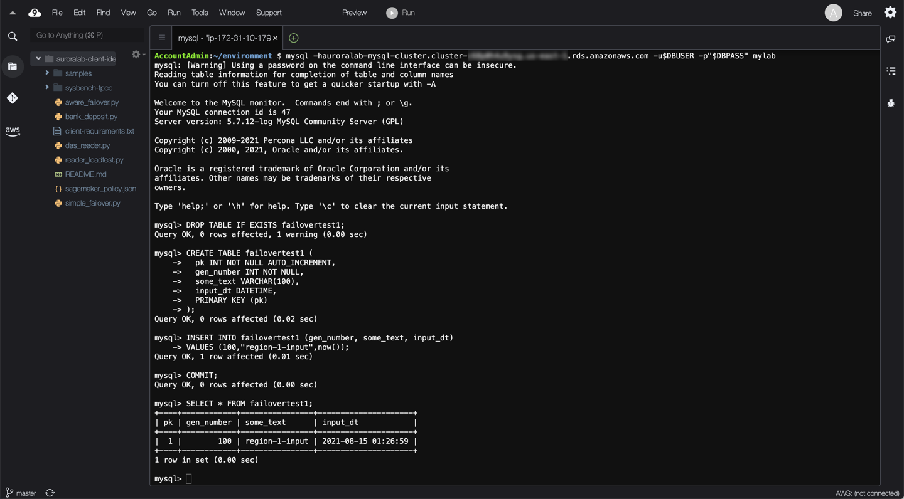
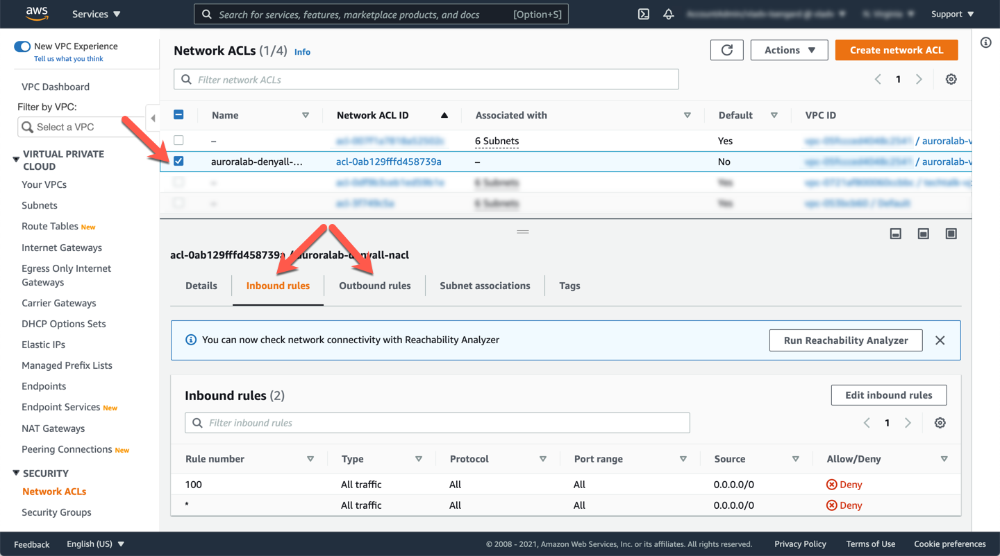
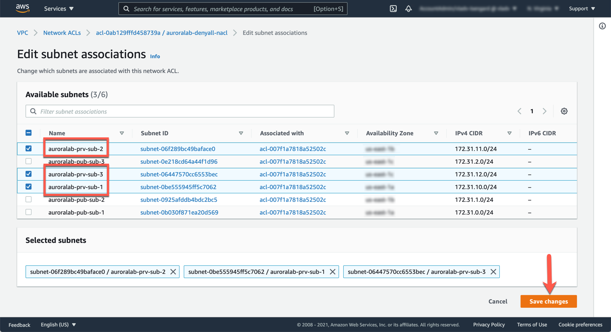
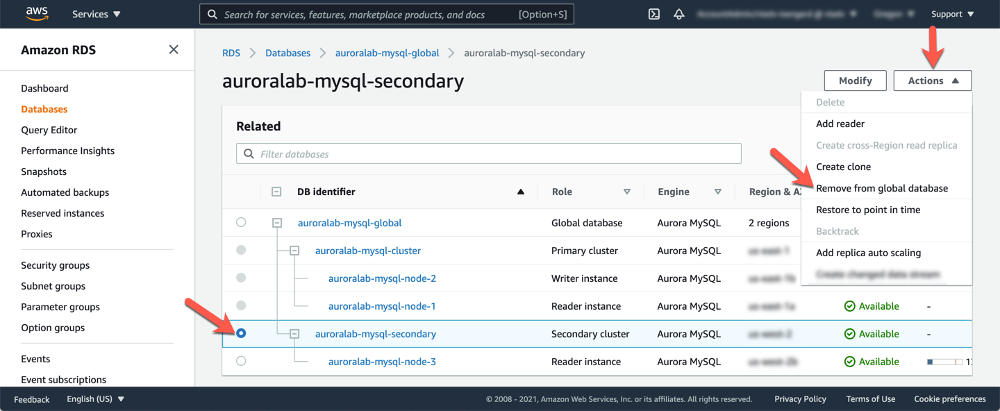
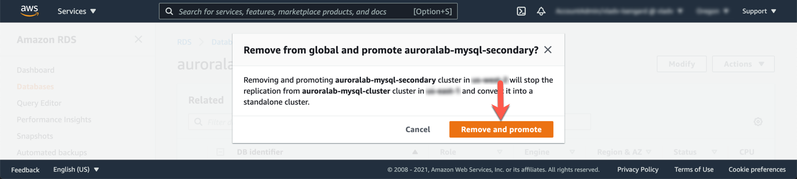
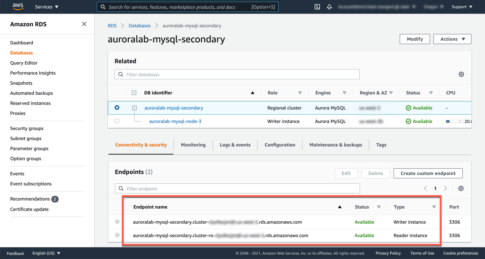
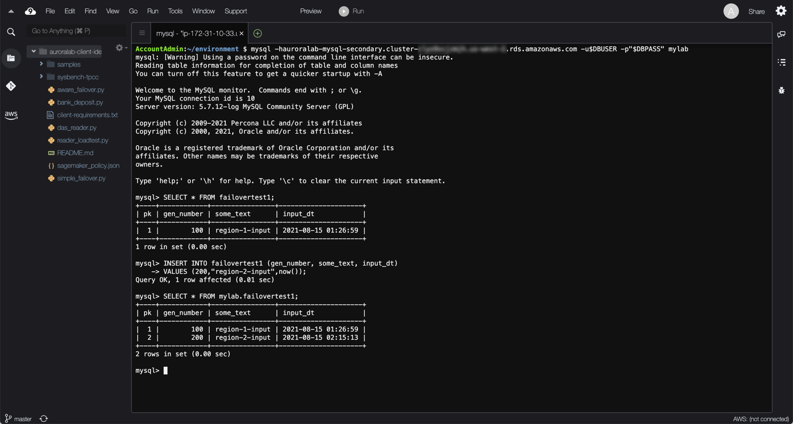
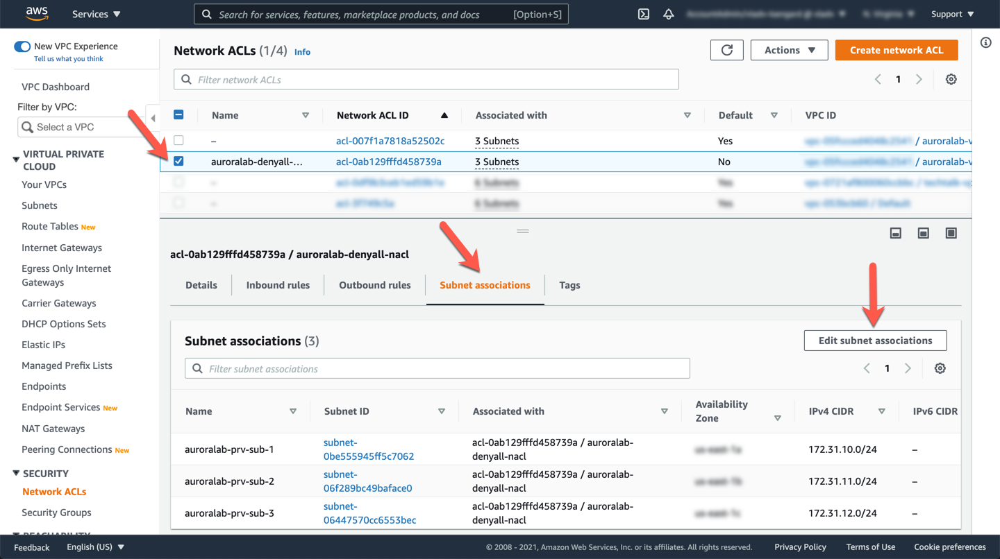
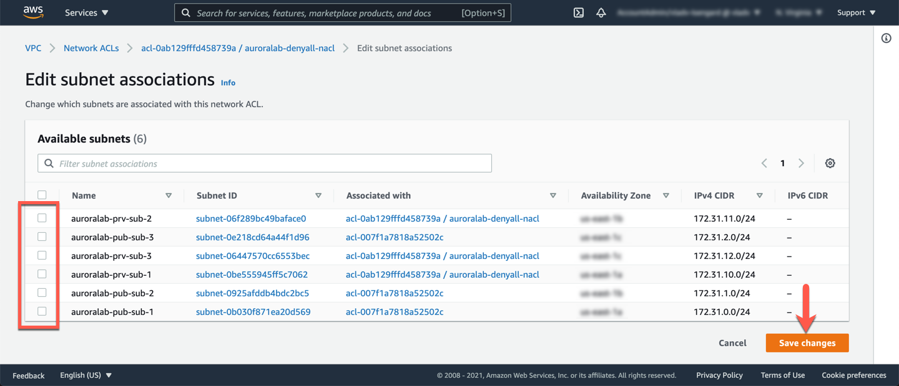

# Recover from an Unplanned Primary DB Cluster Failure

When used in combination with in-region replicas, an Aurora DB cluster provides automatic failover capabilities within the region. Aurora Global Database supports <a href="https://aws.amazon.com/blogs/database/managed-planned-failovers-with-amazon-aurora-global-database/" target="_blank">managed planned failovers</a>, you can manually invoke a process that promotes one of the existing secondary regions to be the new primary region, and demotes the existing primary to be a secondary region. AWS will orchestrate this process to ensure there is no data loss and the topology of the cluster is maintained. A **managed planned** failover, however, requires a healthy global database cluster. This lab demonstrates how you can recover from an **unplanned event** in the unlikely scenario of an entire region's infrastructure or service becoming unavailable.

Combined with an application layer that is deployed cross-region (via immutable infrastructure or (<a href="https://docs.aws.amazon.com/AWSEC2/latest/UserGuide/CopyingAMIs.html" target="_blank">copying your AMIs cross-region</a>), you can further increase your applications' availability while maintaining data consistency.

This lab contains the following tasks:

1. Simulate a primary region failure
2. Promote the secondary DB cluster
3. End the simulated failure in the primary region

This lab requires the following prerequisites:

* [Get Started](/prereqs/environment/) (choose the **Deploy Global DB** option)
* [Connect to the Cloud9 Desktop](/prereqs/connect/)
* [Deploy an Aurora Global Database](/global/deploy/)


## 1. Simulate a primary region failure

If you have not already opened a terminal window or the Cloud9 desktop in a previous lab, please [following these instructions](/prereqs/connect/) to do so now in the **primary region**. Once connected, run the command below, replacing the ==[clusterEndpoint]== placeholder with the cluster endpoint of your DB cluster.

!!! warning "Region Check"
    Ensure you are still working in the **primary region**, especially if you are the links in this guide to open the service console at the right screen.

```
mysql -h[clusterEndpoint] -u$DBUSER -p"$DBPASS" mylab
```

!!! tip "Where do I find the cluster endpoint (or any other placeholder parameters)?"
    Since you are working with an Aurora Global Database, there are multiple endpoints, across the primary and secondary regions you will have to keep track of. Check the end of the [Deploy a Global Database](global/deploy/) lab for instructions on how to find the endpoints of the cluster.

Once connected to the database, use the commands below to create a table:

```
DROP TABLE IF EXISTS failovertest1;
CREATE TABLE failovertest1 (
  pk INT NOT NULL AUTO_INCREMENT,
  gen_number INT NOT NULL,
  some_text VARCHAR(100),
  input_dt DATETIME,
  PRIMARY KEY (pk)
);
INSERT INTO failovertest1 (gen_number, some_text, input_dt)
VALUES (100,"region-1-input",now());
COMMIT;
SELECT * FROM failovertest1;
```

Take a note of the query results, you'll use them later to compare.

<span class="image"></span>

You can simulate an in-region failure using several mechanisms, see the [Test Fault Tolerance](/provisioned/failover/) lab for hands-on exercises to test that out. However, in this case you will need to simulate that the primary region becomes unavailable, including the primary DB cluster. There is no comprehensive way to simulate such a failure, but you can simulate a longer term and larger scale failure by stopping all ingress/egress data traffic in and out of the Aurora Global Database's primary DB cluster. Your lab environment contains a <a href="https://docs.aws.amazon.com/vpc/latest/userguide/vpc-network-acls.html" target="_blank">VPC Network ACL</a> (NACL) with a specific **DENY ALL** rule that will block all ingress/egress traffic out of the associated subnets. This will essentially emulate a wider failure that will render your primary region DB cluster unavailable to your applications.

Open the <a href="https://console.aws.amazon.com/vpc/home#acls:sort=networkAclId" target="_blank">VPC service console</a> in the **primary region** at the **Network ACLs** section. You should see a NACL named **auroralab-denyall-nacl**, and that it is not currently associated with any subnets. Select it by checking the box next to the name and review both the **Inbound Rules** and **Outbound Rules** tabs in the bottom detail panel. You should see that they're set to *DENY* for ALL traffic.

!!! warning "Region Check"
    Ensure you are still working in the **primary region**, especially if you are following the links above to open the service console at the right screen.

<span class="image"></span>

Toggle to the **Subnet associations** tab of the selected NACL in the detail panel, and then click the **Edit subnet associations** button.

The Aurora DB cluster is configured to use the **private subnets** configured for your lab environment, and governed by RDS DB subnet group created for your lab environment. All these subnets are named with the prefix `auroralab-prv-sub-`, followed by a number corresponding to the Availability Zone. You may need to drag the **Subnet ID** column wider to see the names.

Select all subnets that begin with this name prefix. You can also simply use the search box to filter on any subnets with the name **prv** and then select them. Next, click on the **Edit** button to confirm the associations.

<span class="image"></span>

Once associated, the NACL rules take effect immediately and will render the resources within the private subnets unreachable. Your connection to the Cloud9 desktop should eventually also break with an error message indicating that the client lost connection to the server.

## 2. Promote the secondary DB cluster

You are simulating a prolonged regional infrastructure or service level failure, at which point, you would typically opt to perform a regional failover to your DR site for your application and database stacks. Next, you will promote the **secondary DB cluster**, in the **secondary region** to an independent regional DB cluster.

Open the <a href="https://console.aws.amazon.com/rds/home?region=us-east-1#database:id=auroralab-mysql-secondary;is-cluster=true" target="_blank">Amazon RDS service console</a> at the MySQL DB cluster details page of the **secondary DB cluster**. 

!!! warning "Region Check"
    Ensure you are still working in the **secondary region**, especially if you are following the links above to open the service console at the right screen.

??? tip "Why does the status of my primary DB cluster and DB instance still report as <i>Available</i>?"
    You might also notice that in your RDS console it will still report the primary region DB cluster and DB instance as **Available**, that is because you are merely simulating a failure by blocking all networking access via NACLs, and the blast radius of such a simulation is limited only to your AWS Account, specifically to your VPC and its affected subnets; the RDS/Aurora service and its internal health checks are provided by the service control plane itself and will still report the DB cluster and DB instance as healthy because there is no *real outage*.

With the secondary DB Cluster `auroralab-mysql-secondary` selected, click on the **Actions** menu, then select **Remove from global database**.

<span class="image"></span>

A message will pop up asking you to confirm that this will break replication from the primary DB cluster. Confirm by clicking on **Remove and promote**.

<span class="image"></span>

The promotion process should take less than 1 minute. Once complete, you should be able to see the previously secondary DB cluster is now labeled as **Regional cluster** and the DB instance is now a **Writer instance** node.

Click on the newly promoted DB cluster. Under the **Connectivity and security** tab, the **Writer instance** endpoint should now be listed as **Available**. Copy and paste the endpoint string into your notepad.

<span class="image"></span>

If you have not already opened a terminal window or the Cloud9 desktop in the **secondary region** in a previous lab, please [following these instructions](/prereqs/connect/) to do so now. Make sure you use the CLoud9 Desktop URL in the **secondary region**.

!!! warning "Region Check"
    Ensure you are still working in the **secondary region**, especially if you are the links in this guide to open the service console at the right screen.

Once connected, if you have not done so in a previous lab, you need to set up the database credentials on the Cloud9 desktop in the secondary region. If you have created the original primary DB cluster manually, you have performed a similar step at that time. Run the following commands, replacing the placeholders with values as indicated in the below table:

Placeholder | Where to find it
----- | -----
==[secretArn]== | If you are participating in a formal workshop, and the lab environment was provisioned for you using Event Engine, the value of the Secret ARN may be found on the Team Dashboard in Event Engine. Otherwise you will find it in the Outputs of the CloudFormation stack you used to provision the lab environment. The value starts with `arn:aws:secretsmanager:`.
==[primaryRegion]== | The identifier of the **primary region** you are using, click on the name in the top right corner of the console. You'll find it next to the name, for example `us-west-2`, although your region may vary.


```
CREDS=`aws secretsmanager get-secret-value --secret-id [secretArn] --region [primaryRegion] | jq -r '.SecretString'`
export DBUSER="`echo $CREDS | jq -r '.username'`"
export DBPASS="`echo $CREDS | jq -r '.password'`"
echo "export DBPASS=\"$DBPASS\"" >> /home/ec2-user/.bashrc
echo "export DBUSER=$DBUSER" >> /home/ec2-user/.bashrc
```

Next, run the command below, replacing the ==[newClusterEndpoint]== placeholder with the cluster endpoint of your newly promoted DB cluster.

```
mysql -h[newClusterEndpoint] -u$DBUSER -p"$DBPASS" mylab
```

!!! tip "Where do I find the cluster endpoint (or any other placeholder parameters)?"
    Since you are working with an Aurora Global Database, there are multiple endpoints, across the primary and secondary regions you will have to keep track of. Check the end of the [Deploy a Global Database](global/deploy/) lab for instructions on how to find the endpoints of the cluster.

Once connected to the database, use the code below to create a table. Run the following SQL queries:

```
SELECT * FROM failovertest1;
```

Note the query results, this should return the new table and record you entered into the Database shortly before the simulated failure.

Insert a new record to this table. Copy and paste the following query and run it. What do you expect the results to be?

```
INSERT INTO failovertest1 (gen_number, some_text, input_dt)
VALUES (200,"region-2-input",now());
SELECT * FROM mylab.failovertest1;
```

You should notice both your previous results before failover and the new record. Your application can now serve both read and write queries from what used to be your **secondary region** and serve your users as normal, during a region-wide disruption!

<span class="image"></span>

Since the data is now stale, and out of date compared to the secondary region Aurora DB cluster that was promoted, the Aurora DB cluster and DB instances in the primary region are no longer needed, for the purposes of the Global Database labs. Normally you would want to delete them, **but don't**. There may be other labs in your curriculum that depend on this DB cluster. 

You can however delete the global cluster, by removing that original DB cluster in the primary region, from the global cluster, and then deleting the global cluster.


## 3. End the simulated failure in the primary region

It is important to end the simulated failure at this point, as you will be unable to run through any subsequent labs if you do not. You have been simulating a large scale disruption by associating a **Network ACL (NACL)** rule that denies all network traffic with the subnets where the Aurora Global Database primary DB cluster was deployed. Let's revert this to end the traffic block.

Go to your <a href="https://console.aws.amazon.com/vpc/home#acls:sort=networkAclId" target="_blank">VPC service console</a> in the **primary region**, select the NACL named **auroralab-denyall-nacl**, and navigate to the **Subnet associations** tab.

<span class="image"></span>

**Uncheck all** subnet selections then click **Save changes**.

<span class="image"></span>

You may need to refresh the browser page or tab containing the Cloud9 desktop in the **primary region** at this point to restore connectivity.


