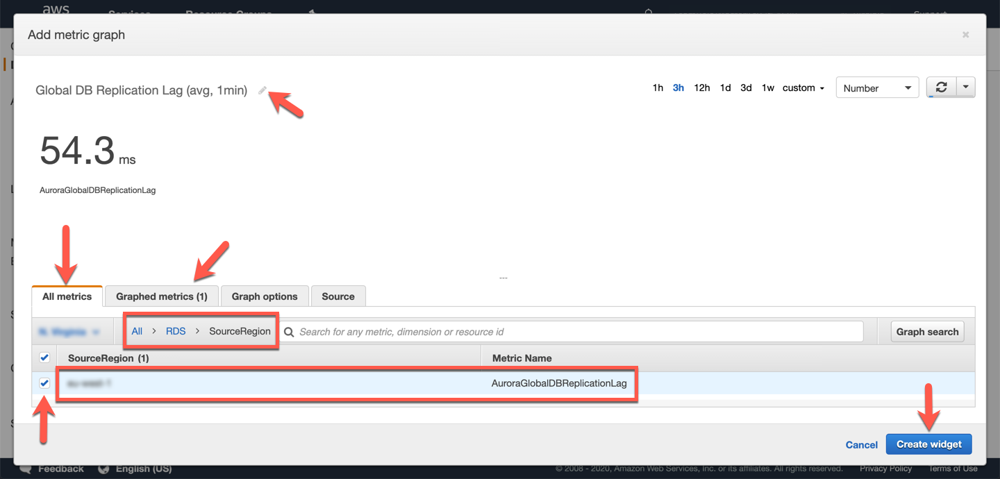

# Monitor a Global Database

::TODO:: adjust from here on down

Amazon Aurora vends a variety of [Amazon CloudWatch metrics](https://docs.aws.amazon.com/AmazonRDS/latest/AuroraUserGuide/Aurora.Monitoring.html) that you can use to monitor and determine the health and performance of your Aurora Global Database. In this lab we will be creating a Amazon CloudWatch Dashboard to monitor for the latency, replicated IO and the cross region replication data transfer for our Aurora Global Database.

This lab contains the following tasks:

1. Monitor cluster load and replication lag


This lab requires the following prerequisites:

* [Get Started](/prereqs/environment/) (you do not need to provision a DB cluster automatically)
* [Connect to the Session Manager Workstation](/prereqs/connect/)
* [Deploy an Aurora Global Database](/global/deploy/)

::TODO:: adjust from here on down

## 1. Monitor cluster load and replication lag

Since the new **primary DB cluster** was in-use before you created the Global cluster using it, you can review the performance metrics of the cluster. In the RDS service console, select the `auroralab-mysql-cluster` (primary), if it is not already selected and toggle to the **Monitoring** tab. You will see a combined view of both the writer and reader DB instances in that cluster. You are not using the reader at this time, the load is directed only to the writer. Navigate through the metrics, and specifically review the **CPU Utilization**, **Commit Throughput**, **DML Throughput**, **Select Throughput** metrics, and notice they are fairly stable, beyond the initial spike caused by the sysbench tool populating an initial data set.

<span class="image"></span>

Next you will shift focus to the newly created **secondary DB cluster**. You will create a CloudWatch Dashboard to monitor three key metrics relevant to global clusters, and secondary DB clusters more specifically:

CloudWatch Metric Name | Description
----- | -----
`AuroraGlobalDBReplicatedWriteIO` | The number of Write IO replicated to the secondary region
`AuroraGlobalDBDataTransferBytes` | The amount of redo logs transferred to the secondary region, in bytes
`AuroraGlobalDBReplicationLag` | How far behind, measured in milliseconds, the secondary region lags behind the writer in the primary region

!!! warning "Region Check"
    You are going to work in a different region in the subsequent steps: N. Virginia (us-east-1). As you have multiple browser tabs and command line sessions open, please make sure you are always operating in the intended region.

Open the <a href="https://console.aws.amazon.com/cloudwatch/home?region=us-east-1#dashboards:" target="_blank">Amazon CloudWatch service console</a> in the secondary region at the **Dashboards** feature.

<span class="image"></span>

Click **Create dashboard**. Let's name our new dashboard `auroralab-gdb-dashboard` and click on the **Create dashboard** button again.

<span class="image"></span>

Let's add our first widget on the dashboard that will show our replication latency between the secondary and primary Aurora cluster. Select **Number** and then click on **Configure**.

<span class="image"></span>

In the **Add Metric Graph** screen, we will look under the **All Metrics** tab, and select **RDS**, and then select the metrics group named **SourceRegion**.

You should now see a filtered Metric Name `AuroraGlobalDBReplicationLag`, with the SourceRegion column as the name of your primary region of the global cluster. Select this metric using the checkbox.

The widget preview should now be on top with a sample of the lag time in milliseconds. Let's further update the widget. Give it a friendly name by clicking on the edit icon (pencil icon) and rename the widget from `Untitled Graph` to `Global DB Replication Lag (avg, 1min)`, press the tick/check icon to submit your changes.

On the bottom, click on the **Graph Metrics** tab to further customize our view. Under the **Statistic** column, we want to change this to `Average` and **Period** to `1 Minute`.

Confirm your settings are similar to the example below, and then click **Create widget**.

<span class="image"></span>

Now you have created your first widget. You can set this to Auto refresh on a set interval on the top right refresh menu.

Click **Save dashboard** to save your changes.

<span class="image"></span>

You can add widgets individually to the dashboard, to build a more complete monitoring dashboard. However, to save some time you will simply update the source of the dashboard with the below JSON specification.

First, click the **Actions** dropdown on the dashboard, and choose **View/edit source**.

<span class="image"></span>

In the textbox that appears on the screen, paste the following JSON code. Be sure to update the correct AWS regions, corresponding to your primary and secondary DB clusters, if needed in the code below. Also, if you used different DB cluster identifiers (names) for the DB clusters than the ones indicated in this guide, you will have to update those as well.

```json
{
    "widgets": [
        {
            "type": "metric",
            "x": 0,
            "y": 0,
            "width": 6,
            "height": 6,
            "properties": {
                "metrics": [
                    [ "AWS/RDS", "AuroraGlobalDBReplicationLag", "SourceRegion", "eu-west-1" ]
                ],
                "view": "singleValue",
                "region": "us-east-1",
                "stat": "Average",
                "period": 60,
                "title": "Global DB Replication Lag (avg, 1min)"
            }
        },
        {
            "type": "metric",
            "x": 6,
            "y": 0,
            "width": 18,
            "height": 6,
            "properties": {
                "metrics": [
                    [ "AWS/RDS", "AuroraGlobalDBReplicationLag", "SourceRegion", "eu-west-1" ],
                    [ "...", { "stat": "Maximum" } ]
                ],
                "view": "timeSeries",
                "stacked": false,
                "region": "us-east-1",
                "title": "Global DB Replication Lag (max vs. avg, 1min)",
                "stat": "Average",
                "period": 60
            }
        }
    ]
}
```

Click **Update** to change the dashboard.

<span class="image"></span>

Click **Save dashboard** to make sure the dashboard is saved with the new changes.

<span class="image"></span>