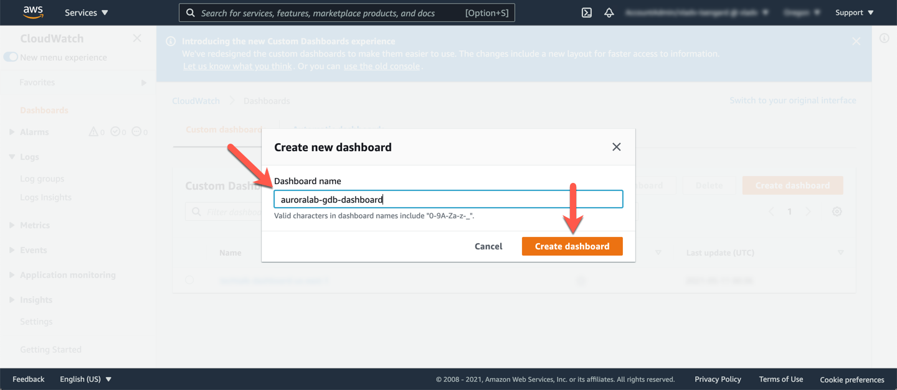
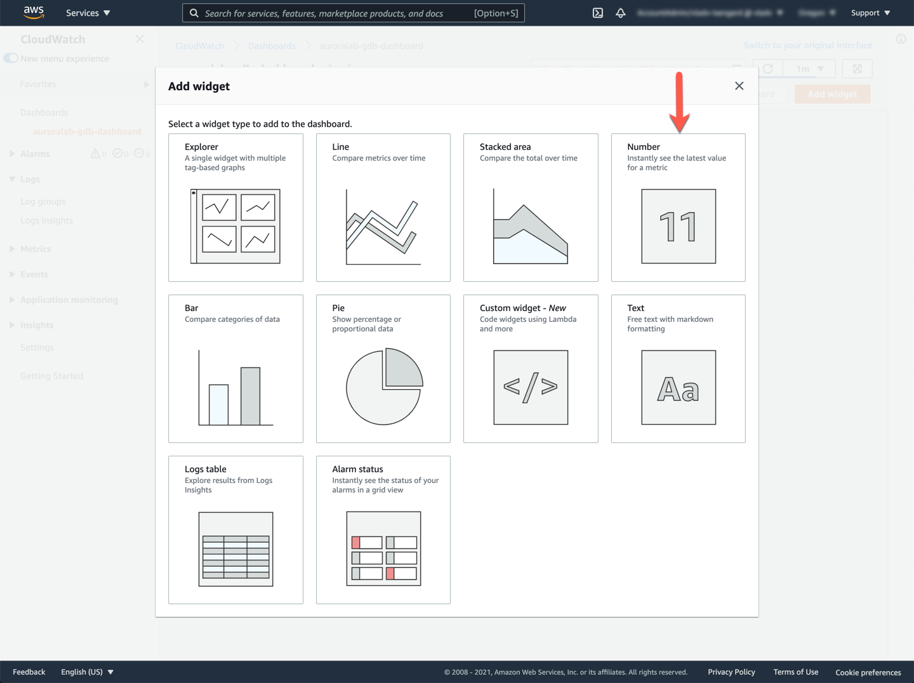
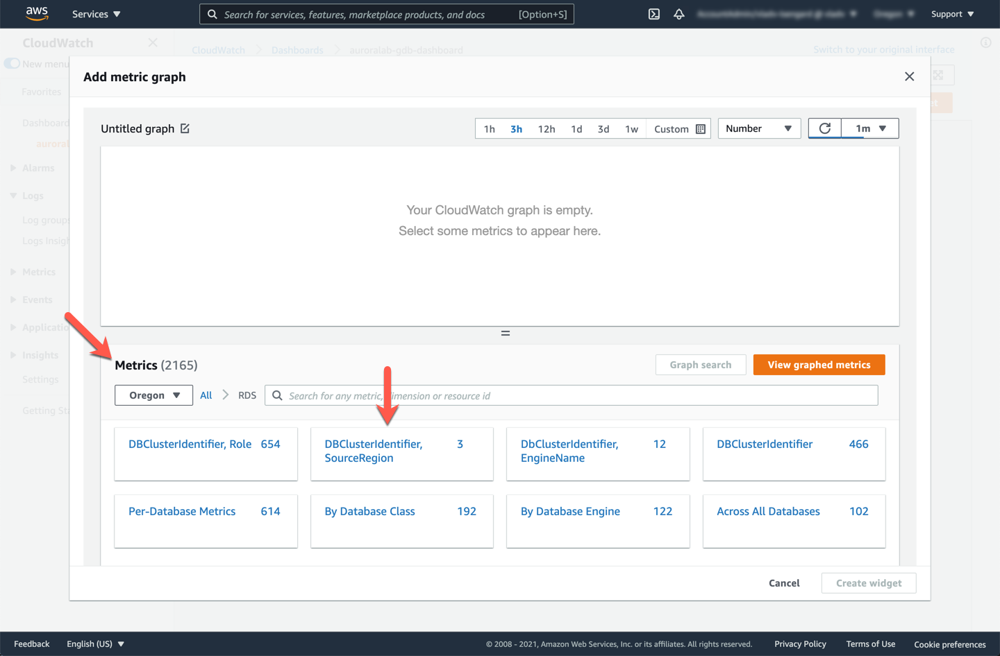
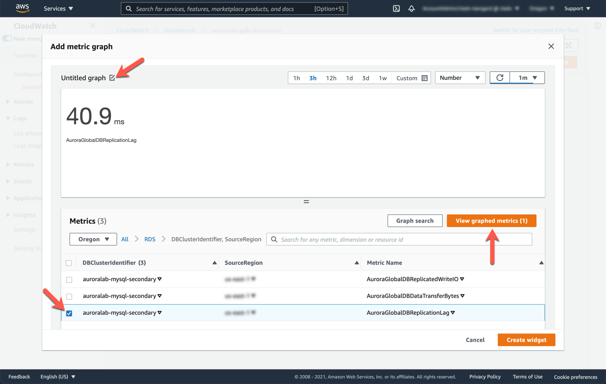
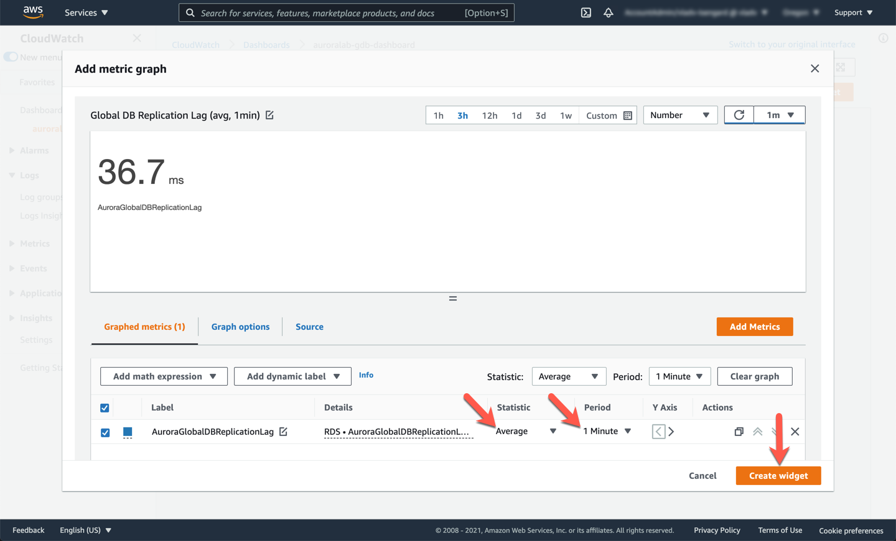
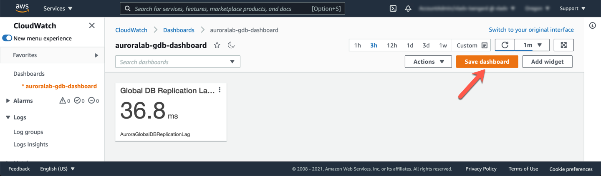
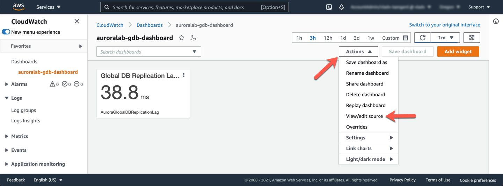
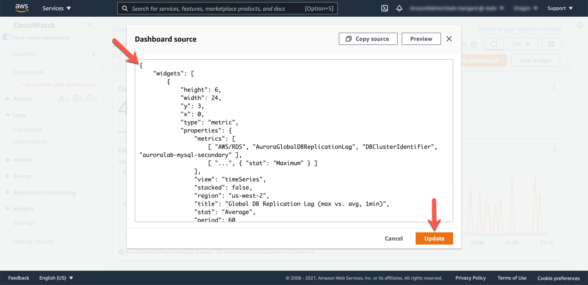
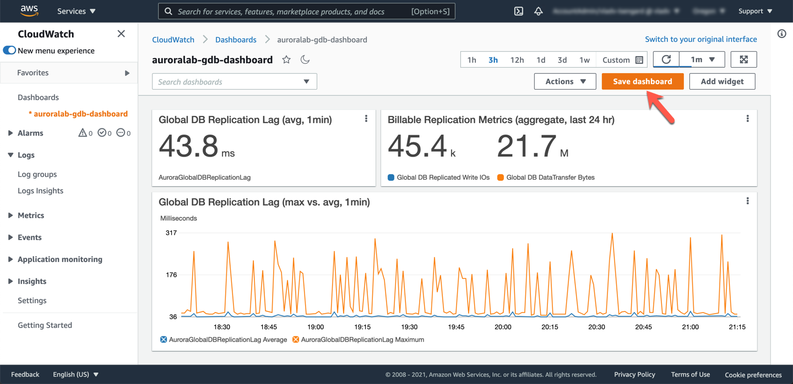

# Monitor a Global Database

Amazon Aurora exposes a variety of <a href="https://docs.aws.amazon.com/AmazonRDS/latest/AuroraUserGuide/Aurora.Monitoring.html" target="_blank">Amazon CloudWatch metrics</a>, that you can use to monitor and determine the health and performance of your Aurora Global Database. In this lab you will create a Amazon CloudWatch Dashboard to monitor for the latency, replicated IO and the cross region replication data transfer for our Aurora Global Database.

This lab contains the following tasks:

1. Generate load on the primary DB cluster
2. Monitor cluster load and replication lag

This lab requires the following prerequisites:

* [Get Started](/prereqs/environment/) (choose the **Deploy Global DB** option)
* [Connect to the Cloud9 Desktop](/prereqs/connect/)
* [Deploy an Aurora Global Database](/global/deploy/)


## 1. Generate load on the primary DB cluster

You will use Percona's TPCC-like benchmark script based on sysbench to generate load. For simplicity we have packaged the correct set of commands in an <a href="https://docs.aws.amazon.com/systems-manager/latest/userguide/sysman-ssm-docs.html" target="_blank">AWS Systems Manager Command Document</a>. You will use <a href="https://docs.aws.amazon.com/systems-manager/latest/userguide/execute-remote-commands.html" target="_blank">AWS Systems Manager Run Command</a> to execute the test.

If you have not already opened a terminal window or the Cloud9 desktop in a previous lab, please [following these instructions](/prereqs/connect/) to do so now. Once connected, choose the tab below that best matches your circumstances, and run the indicated commands:

!!! warning "Region Check"
    Ensure you are still working in the **primary region**, especially if you are the links in this guide to open the service console at the right screen.

=== "The DB cluster has been pre-created for me"
    If AWS CloudFormation has provisioned the DB cluster on your behalf, and you skipped the **Create a New DB Cluster** lab, you can run the simplified command below:

        aws ssm send-command \
        --document-name auroralab-sysbench-test \
        --instance-ids `wget -q -O - http://169.254.169.254/latest/meta-data/instance-id`


=== "I have created the DB cluster myself"
    If you have completed the [Create a New DB Cluster](/provisioned/create/) lab, and created the Aurora DB cluster manually execute the command below, replacing the ==[clusterEndpoint]== placeholder with the cluster endpoint of your DB cluster.

        aws ssm send-command \
        --document-name auroralab-sysbench-test \
        --instance-ids `wget -q -O - http://169.254.169.254/latest/meta-data/instance-id` \
        --parameters \
        clusterEndpoint=[clusterEndpoint],\
        dbUser=$DBUSER,\
        dbPassword="$DBPASS"

??? tip "What do all these parameters mean?"
    Parameter | Description
    --- | ---
    --document-name | The name of the command document to run on your behalf.
    --instance-ids | The EC2 instance to execute this command on.
    --parameters | Additional command parameters.

The command will be sent to the Cloud9 desktop EC2 instance which will prepare the test data set and run the load test. It may take up to a minute for CloudWatch to reflect the additional load in the metrics. You will see a confirmation that the command has been initiated.

<span class="image"></span>


## 2. Monitor cluster load and replication lag

In the RDS service console in the **primary region**, select the `auroralab-mysql-cluster` (primary), if it is not already selected and toggle to the **Monitoring** tab. You will see a combined view of both the writer and reader DB instances in that cluster. You are not using the reader at this time, the load is directed only to the writer. Navigate through the metrics, and specifically review the **CPU Utilization**, **Commit Throughput**, **DML Throughput**, **Select Throughput** metrics, and notice they are fairly stable, beyond the initial spike caused by the sysbench tool populating an initial data set.

<span class="image"></span>

Next you will shift focus to the newly created **secondary DB cluster**. You will create a CloudWatch Dashboard to monitor three key metrics relevant to global clusters, and secondary DB clusters more specifically:

CloudWatch Metric Name | Description
----- | -----
`AuroraGlobalDBReplicatedWriteIO` | The number of Write IO replicated to the secondary region
`AuroraGlobalDBDataTransferBytes` | The amount of redo logs transferred to the secondary region, in bytes
`AuroraGlobalDBReplicationLag` | How far behind, measured in milliseconds, the secondary region lags behind the writer in the primary region

Open the <a href="https://console.aws.amazon.com/cloudwatch/home?region=us-east-1#dashboards:" target="_blank">Amazon CloudWatch service console</a> in the secondary region at the **Dashboards** feature.

!!! warning "Region Check"
    You are going to work in a different region in the subsequent steps: N. Virginia (us-east-1). As you have multiple browser tabs and command line sessions open, please make sure you are always operating in the intended region.

!!! warning "Console Experience Updates"
    The CloudWatch service team is in the process of updating the service console web interface to improve the experience. Depending on when you are running the labs, you may be offered the old or the new experience. A banner will allow you to switch between them. The screenshots below are using the new console experience.


<span class="image"></span>

Click **Create dashboard**. Name the new dashboard `auroralab-gdb-dashboard` and click on the **Create dashboard** button again.

<span class="image"></span>

Next, add the first widget on the dashboard that will show replication latency between the secondary and primary Aurora cluster. Select **Number**.

<span class="image"></span>

On the **Add metric graph** screen, in the **Metrics** tab, expand **AWS Namespaces** if needed. From the list of services, select **RDS**, and then select the metrics group named **DBClusterIdentifier, SourceRegion**.

<span class="image"></span>

You should now see a filtered list of metrics. Choose the metric named `AuroraGlobalDBReplicationLag` and select this metric using the checkbox.

The widget preview should now be on top with a sample of the lag time in milliseconds. Give the widget a friendly name by clicking on the edit icon (pencil icon) and rename the widget from `Untitled graph` to `Global DB Replication Lag (avg, 1min)`, click **Apply** to submit your changes.

<span class="image"></span>

On the bottom, click on the **View graphed metrics (1)** button to further customize the view. Under the **Statistic** column, we want to change this to `Average` and **Period** to `1 Minute`.

Confirm your settings are similar to the example below, and then click **Create widget**.

<span class="image"></span>

You have now created your first widget. You can set this to Auto refresh on a set interval on the top right refresh menu.

Click **Save dashboard** to save your changes.

<span class="image"></span>

You can add widgets individually to the dashboard, to build a more complete monitoring dashboard. However, to save some time you will simply update the source of the dashboard with the below JSON specification.

First, click the **Actions** dropdown on the dashboard, and choose **View/edit source**.

<span class="image"></span>

In the textbox that appears on the screen, paste the following JSON code. Be sure to update the AWS region, to match your **secondary region**, if needed in the code below. Also, if you used different DB cluster identifiers (names) for the DB clusters than the ones indicated in this guide, you will have to update those as well.

```json
{
    "widgets": [
        {
            "type": "metric",
            "x": 0,
            "y": 3,
            "width": 24,
            "height": 6,
            "properties": {
                "metrics": [
                    [ "AWS/RDS", "AuroraGlobalDBReplicationLag", "DBClusterIdentifier", "auroralab-mysql-secondary" ],
                    [ "...", { "stat": "Maximum" } ]
                ],
                "view": "timeSeries",
                "stacked": false,
                "region": "us-east-1",
                "title": "Global DB Replication Lag (max vs. avg, 1min)",
                "stat": "Average",
                "period": 60
            }
        },
        {
            "type": "metric",
            "x": 0,
            "y": 0,
            "width": 9,
            "height": 3,
            "properties": {
                "metrics": [
                    [ "AWS/RDS", "AuroraGlobalDBReplicationLag", "DBClusterIdentifier", "auroralab-mysql-secondary" ]
                ],
                "view": "singleValue",
                "region": "us-east-1",
                "title": "Global DB Replication Lag (avg, 1min)",
                "stat": "Average",
                "period": 60
            }
        },
        {
            "type": "metric",
            "x": 9,
            "y": 0,
            "width": 15,
            "height": 3,
            "properties": {
                "metrics": [
                    [ "AWS/RDS", "AuroraGlobalDBReplicatedWriteIO", "DBClusterIdentifier", "auroralab-mysql-secondary", { "label": "Global DB Replicated Write IOs" } ],
                    [ ".", "AuroraGlobalDBDataTransferBytes", ".", ".", { "label": "Global DB DataTransfer Bytes" } ]
                ],
                "view": "singleValue",
                "region": "us-east-1",
                "stat": "Sum",
                "period": 86400,
                "title": "Billable Replication Metrics (aggregate, last 24 hr)"
            }
        }
    ]
}
```

Click **Update** to change the dashboard.

<span class="image"></span>

Click **Save dashboard** to make sure the dashboard is saved with the new changes.

<span class="image"></span>

!!! note
    The **Aurora Global DB Replicated I/O** and **Aurora Global DB Data Transfer Bytes** metrics are only reported once an hour, so you may not be able to see any data for those metrics depending on the timing of your lab. If you are doing other labs, please continue with those labs, and come back later to check these metrics.
