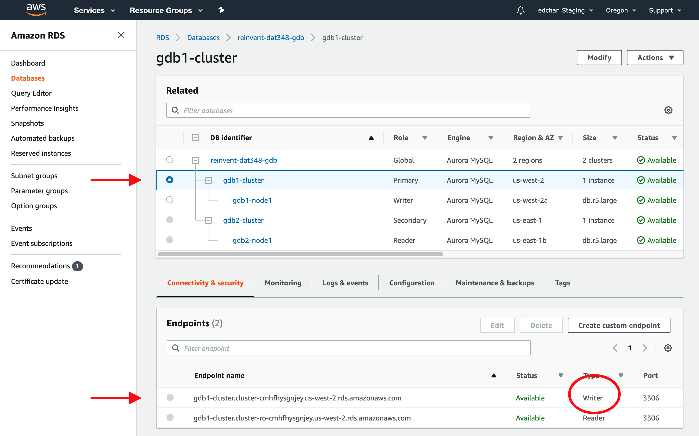
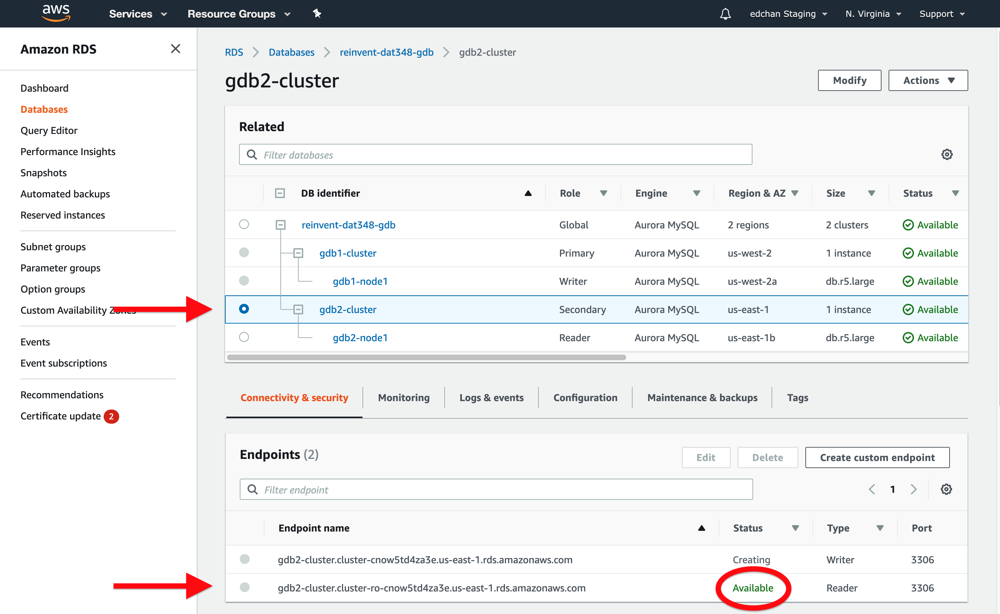
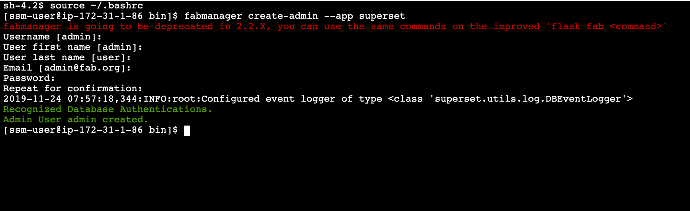
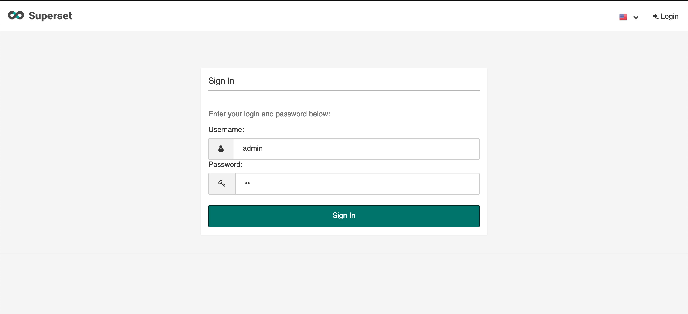
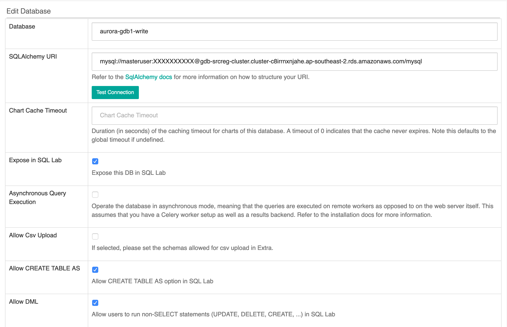
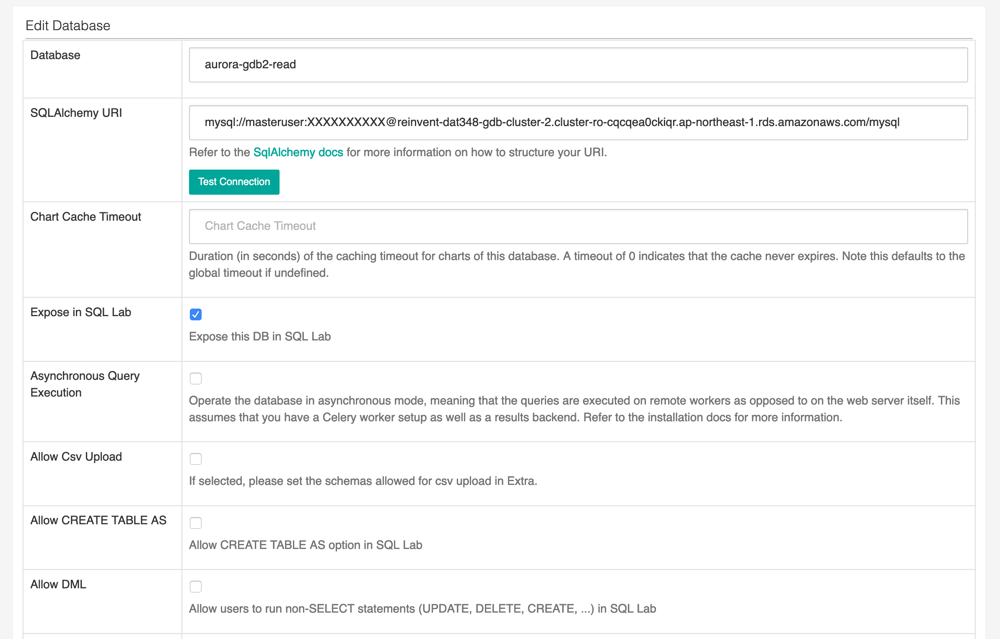
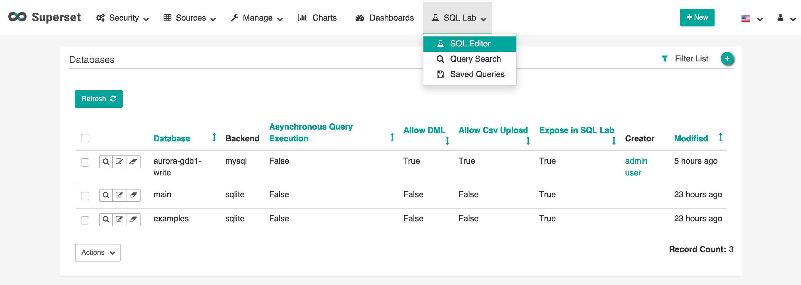
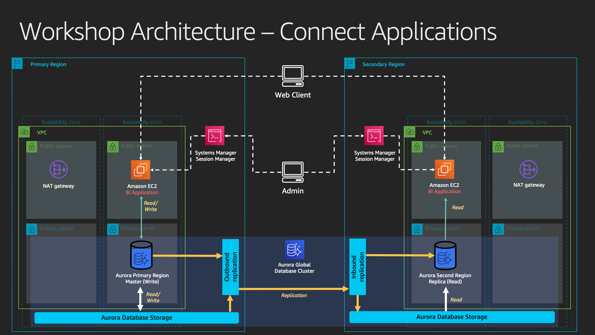

# Connect Applications

This lab contains the following tasks:

## 3. Connect BI Applications; Aurora Global Database in action

Amazon Aurora provides both MySQL and PostgreSQL compatible database engines. This means any existing applications that work with MySQL and PostgreSQL will have drop-in compatibility with Amazon Aurora. For this workshop, we will be deploying a business intelligence (BI) application that is running on Amazon EC2 instance in each of the two regions, and connect them to the respective local DB Cluster endpoint of the Aurora Global Database, in order to achieve lower query latency.

For the purpose of this workshop, we will be using [Apache Superset (incubating)](https://superset.incubator.apache.org/) as the BI web application. Superset is an open source, business intelligence and data exploration platform designed to be visual, intuitive and interactive.


<details>
<summary>Connecting to EC2 Instances - Additional Details</summary>
Those who have been familiar with AWS for a while may remember that connecting to a remote Amazon EC2 instance requires opening inbound SSH or Powershell ports, provisioning SSH keys and management of certificates. With AWS Systems Manager Session Manager, you can connect to an EC2 instance with just few clicks and experience a secure browser-based CLI, without having to provision or create SSH keys.
</details>

#

### Gathering Aurora Global Database Endpoint Details

>  **`Region 1 (Primary)`** 

Before we begin, we will return to our RDS console (the Aurora Global Database will be visible in either region) to copy the local endpoints to the Aurora Global Database that we will be using for our BI applications to connect to.

1. In the AWS Management Console, ensure that you are working within your assigned primary region. Using the Service menu, click on or type to search for **RDS**. This will bring up the Amazon RDS console. 

1. Within the RDS console, select **Databases** on the left menu. This will bring you to the list of Databases already deployed. You should see both the original primary DB cluster and the newly created secondary DB cluster grouped under your Global Database.

   * Note: This main RDS Databases view will display all Aurora Global Database clusters regardless of your selected region, along with RDS DB instances that are local to the selected region.

1. Click on **gdb1-cluster** (also indicated by *Primary* Role), under the **Connectivity and security** tab, look for the endpoint with the Type *Writer*. Copy the endpoint address to your notepad application. This will be the Primary DB Cluster writer endpoint, in the similar format as below.

   ```gdb1-cluster.cluster-abcdefghijk.xx-region-X.rds.amazonaws.com``` (Primary Writer)

   
   
**`Region 2 (Secondary)`** 

1. Use the top menu to switch to the secondary region assigned to you. Within the RDS console, select **Databases** on the left menu.

1. Click on **gdb2-cluster** (also indicated by *Secondary* Role), under the **Connectivity and security** tab, copy both the endpoint addresses to your notepad application. This will be the Secondary DB Cluster writer and reader endpoints, in the similar format as below. The -ro- in the reader endpoint indicates its READ-ONLY status.

   ```gdb2-cluster.cluster-abcdefghijk.xx-region-X.rds.amazonaws.com```

   ```gdb2-cluster.cluster-ro-abcdefghijk.xx-region-X.rds.amazonaws.com```

   

   Note: As Secondary cluster's current role is a read-only DB cluster, you will notice that the Endpoint status will remain on *Creating* - this is expected to remain until this cluster is promoted to primary, as this DB cluster is not on a writeable mode and the writer endpoint will remain unuseable until later in the workshop.

# 


#

### Primary Region - Application Instance Setup

<details>
<summary>Click to expand for application instance setup instructions</summary>

>  **`Region 1 (Primary)`** 


1. In the AWS Management Console, ensure that you are working within your assigned primary region. Using the Service menu, click on or type to search for **Systems Manager**. This will bring up the AWS Systems Manager console.

1. Within the Systems Manager console, select **Session Manager** on the left menu. Click on the **Start Session** button.

1. You should now see your EC2 hosts that are running which you can connect to. Select ``gdb1-superset-host``, then click on the **Start Session** button. This will open a new browser tab with the terminal session. Copy and paste the following commands into the terminal, and press Enter after pasting.

   1. Let's start with enabling bash on the terminal view

      ```
      source ~/.bashrc
      ```
   1. We will now create an admin user for the Apache Superset application

      ```
      fabmanager create-admin --app superset
      ```

      You will be prompted for the following:
       * Username (press enter for default)
       * First Name (press enter for default)
       * Last Name (press enter for default)
       * Email (press enter for default)
       * Password (create your password, <span style="color:red;">don't forget this!</span>)
       * Repeat for Confirmation (confirm your password)

    1. Once complete you will receive the message that admin has been created

       

    1. Next, we will run the following commands to initiate and run the Superset application in the background. Include the final ampersand "&" while copying and pasting.

       ```
       superset db upgrade
       superset load_examples
       superset init
       nohup gunicorn -b 0.0.0.0:8088 --limit-request-line 0 --limit-request-field_size 0 superset:app &
       ```

    1. The application will take a minute or two to build samples and initialize. Remember to press ENTER to submit the last command. Once you see the message similar to that below, Superset is running, with the service running by a web server ``gunicorn`` on TCP port 8088. Press ENTER again after the below output to return to the terminal.

       ```
       nohup: ignoring input and appending output to ‘/home/ssm-user/nohup.out’
       ```

>  **`Region 1 (Primary)`** 

1. Return to your AWS Management Console. Remain in primary region. Using the Service menu, click on or type to search for **CloudFormation**. This will bring up the CloudFormation console.

1. Click on **Stacks**, and select the workshop stack that was originally deployed for this particular region. Click on the **Outputs** tab.

1. Locate the value for the output key ``=[supersetPublicDNSName]=``, and copy the value, this value should be similar to 

    ```ec2-12-34-56-78.<xx-region-x>.compute.amazonaws.com```

1. Open a new browser tab or window. Paste the DNS name value into your address bar, because Superset is running on TCP port 8088, add ``:8088`` in the end, then press enter. Your browser address bar should resemble the following URL:

    ```http://ec2-12-34-56-78.<xx-region-x>.compute.amazonaws.com:8088```

1. You should see the login page for Superset. Type in ```admin``` for **Username** and the password you have entered from previous setup step.

    

1. If login is successful, you will then be taken to the Superset main dashboard.

1. Apache Superset has a number of local sample data installed on the EC2 instance. However we will not be using them for the workshop. Let's create a new datasource for Apache Superset, our Aurora Global Database.

   1. In the Apache Superset navigation menu, mouse over **Sources**, then click on **Databases**.
      

   1. Near the top right, click on the green  :heavy_plus_sign: icon to add a new database source.

   1. Change the below values and press **Save** when done:

      Field | Value and Description
      ----- | -----
      Database | <pre>aurora-gdb1-write</pre> <br> This will be the friendly name of our Aurora Database in Superset<br>&nbsp;
      SQLAlchemy URI | <pre>mysql://masteruser:<b>auroragdb321</b>@<b><i>[Replace with Master Writer Endpoint]</i></b>/mysql</pre> <br> Replace the endpoint with the Primary Writer Endpoint we have gathered previously. The password to connect to the database should remain as ```auroragdb321``` unless you have changed this value during CloudFormation deployment. Click on **Test Connection** to confirm.<br>&nbsp;
      Expose in SQL Lab | :ballot_box_with_check: (Checked)
      Allow CREATE TABLE AS | :ballot_box_with_check: (Checked)
      Allow DML | :ballot_box_with_check: (Checked)

      
   
   4. 

</details>

# 

### Secondary Region - Application Instance Setup

<details>
<summary>The secondary region setup will be very similar, click here to expand/hide setup instructions</summary>

>  **`Region 2 (Secondary)`** 

1. We will repeat some very similar steps on the instance for the secondary region.

1. In the AWS Management Console, ensure that you are working within your assigned primary region. Using the Service menu, click on or type to search for **Systems Manager**. This will bring up the AWS Systems Manager console.

1. Within the Systems Manager console, select **Session Manager** on the left menu. Click on the **Start Session** button.

1. You should now see your EC2 hosts that are running which you can connect to. Select ``gdb2-superset-host``, then click on the **Start Session** button. This will open a new browser tab with the terminal session. Copy and paste the following commands into the terminal, and press Enter after pasting.

   1. Let's start with enabling bash on the terminal view

      ```
      source ~/.bashrc
      ```
   1. We will now create an admin user for the Apache Superset application. Recommended that you reuse the same password that you have used previously in the Primary Region instance for the purpose of this workshop.

      ```
      fabmanager create-admin --app superset
      ```

      You will be prompted for the following:
       * Username (press enter for default)
       * First Name (press enter for default)
       * Last Name (press enter for default)
       * Email (press enter for default)
       * Password (create your password, for this lab we recommend using the same one as before <span style="color:red;">don't forget this!</span>)
       * Repeat for Confirmation (confirm your password)

    1. Once complete you will receive the message that admin has been created

       

    1. Next, we will run the following commands to initiate and run the Superset application in the background. Include the final ampersand "&" while copying and pasting.

       ```
       superset db upgrade
       superset load_examples
       superset init
       nohup gunicorn -b 0.0.0.0:8088 --limit-request-line 0 --limit-request-field_size 0 superset:app &
       ```

    1. The application will take a minute or two to build samples and initialize. Remember to press ENTER to submit the last command. Once you see the message similar to that below, Superset is running, with the service running by a web server ``gunicorn`` on TCP port 8088. Press ENTER again after the below output to return to the terminal.

       ```
       nohup: ignoring input and appending output to ‘/home/ssm-user/nohup.out’
       ```

>  **`Region 2 (Secondary)`** 

1. Return to your AWS Management Console. Remain in secondary region. Using the Service menu, click on or type to search for **CloudFormation**. This will bring up the CloudFormation console.

1. Click on **Stacks**, and select the workshop stack that was originally deployed for this particular region. Click on the **Outputs** tab.

1. Locate the value for the output key ``=[supersetPublicDNSName]=``, and copy the value, this value should be similar to 

    ```ec2-12-34-56-78.<xx-region-x>.compute.amazonaws.com```

1. Open a new browser tab or window. Paste the DNS name value into your address bar, because Superset is running on TCP port 8088, add ``:8088`` in the end, then press enter. Your browser address bar should resemble the following URL:

    ```http://ec2-12-34-56-78.<xx-region-x>.compute.amazonaws.com:8088```

1. You should see the login page for Superset. Type in ```admin``` for **Username** and the password you have entered from previous setup step.

    

1. If login is successful, you will then be taken to the Superset main dashboard.

1. Apache Superset has a number of local sample data installed on the EC2 instance. However we will not be using them for the workshop. Let's create a new datasource for Apache Superset, our Aurora Global Database. Note that we will not be allowing DML queries because the secondary region is serving read-only traffic.

   1. In the Apache Superset navigation menu, mouse over **Sources**, then click on **Databases**.
      

   1. Near the top right, click on the green  :heavy_plus_sign: icon to add a new database source.

   1. Change the below values and press **Save** when done:

      Field | Value and Description
      ----- | -----
      Database | <pre>aurora-gdb2-read</pre> <br> This will be the friendly name of our Aurora Database in Superset<br>&nbsp;
      SQLAlchemy URI | <pre>mysql://masteruser:<b>auroragdb321</b>@<b><i>[Replace with Secondary Reader Endpoint]</i></b>/mysql</pre> <br> Replace the endpoint with the Secondary Reader Endpoint we have gathered previously. The password to connect to the database should remain as ```auroragdb321``` unless you have changed this value during CloudFormation deployment. Click on **Test Connection** to confirm.<br>&nbsp;
      Expose in SQL Lab | :ballot_box_with_check: (Checked)
      Allow CREATE TABLE AS | :black_square_button: (Unchecked)
      Allow DML | :black_square_button: (Unchecked)

      
   
   4. 

</details>

# 


### Checkpoint 1

At this point, you should have the 2 BI application instances, launched in 2 distinct regions, connected to their respective endpoints of the Global Database cluster reader and writer endpoints. Let's recap and ensure we have gathered the follow data (use a notepad of your choice) and copy down the following before we proceed.

> **`Region 1 (Primary)`**

* **Apache Superset Primary URL**: ```http://ec2-12-34-56-78.<xx-region-x>.compute.amazonaws.com:8088```
* **Aurora Cluster Primary Writer Endpoint**: ```gdb1-cluster.cluster-abcdefghijk.xx-region-X.rds.amazonaws.com``` 

> **`Region 2 (Secondary)`**

* **Apache Superset Secondary URL**: ```http://ec2-12-34-56-78.<xx-region-x>.compute.amazonaws.com:8088```
* **Aurora Cluster Secondary Reader Endpoint**: ```gdb2-cluster.cluster-ro-abcdefghijk.xx-region-X.rds.amazonaws.com```
* **Aurora Cluster Secondary Writer Endpoint (for failover)**: ```gdb2-cluster.cluster-abcdefghijk.xx-region-X.rds.amazonaws.com```

#

### Aurora Global Database in Action 

>  **`Region 1 (Primary)`** 

1. Log in to the Primary Region instance of Apache Superset. Use the **Apache Superset Primary URL** from Checkpoint 1 above.

1. In the Apache Superset navigation menu, mouse over **SQL Lab**, then click on **SQL Editor**.
      

1. This opens up a web-based IDE within Superset. On the left menu, select ``mysql aurora-gdb1-write``, for **Database** and then select ``mylab`` for **Schema**. 


1. Copy and paste in the following SQL query and then click on **Run Query**.

   ```
   DROP TABLE IF EXISTS gdbtest1;
   DROP PROCEDURE IF EXISTS InsertRand;

   CREATE TABLE gdbtest1 (
      pk INT NOT NULL AUTO_INCREMENT, 
      gen_number INT NOT NULL,
      PRIMARY KEY (pk)
      ); 

   CREATE PROCEDURE InsertRand(IN NumRows INT, IN MinVal INT, IN MaxVal INT)
      BEGIN
         DECLARE i INT;
         SET i = 1;
         START TRANSACTION;
         WHILE i <= NumRows DO
               INSERT INTO gdbtest1 (gen_number) VALUES (MinVal + CEIL(RAND() * (MaxVal - MinVal)));
               SET i = i + 1;
         END WHILE;
         COMMIT;
      END;
      
   CALL InsertRand(1000000, 1357, 9753);

   SELECT count(pk), sum(gen_number), md5(avg(gen_number)) FROM gdbtest1;
   ```

1. This SQL creates a new table and randomly inserts 1 million records into the Global Database. Note the results in a notepad or leave the browser window open.

>  **`Region 2 (Secondary)`** 

1.  Log in to the Secondary Region instance of Apache Superset. Use the **Apache Superset Secondary URL** from Checkpoint 1 above.

1. In the Apache Superset navigation menu, mouse over **SQL Lab**, then click on **SQL Editor**.

1. This opens up a web-based IDE within Superset. On the left menu, select ``mysql aurora-gdb2-read``, for **Database** and then select ``mylab`` for **Schema**. 


1. Copy and paste in the following SQL query and then click on **Run Query**.

   ```
   SELECT count(pk), sum(gen_number), md5(avg(gen_number)) FROM gdbtest1;
   ```

1. Note the results, the fields should match exactly the same as the previous results in the primary instance. This includes the count of records, sum of randomly generated values, and the md5 hash of the average of the generated values.

   * Bonus: you can also run the checksum command separately on the SQL Editor inside both instances of Superset against both the primary and secondary regions. What do you expect the results to be?

      ```
      CHECKSUM TABLE gdbtest1 EXTENDED;
      ```

### Checkpoint 2

At this point, you now see the power and reach of Aurora Global Database. Your data is replicated within less than a second over to the secondary region, while allowing the secondary region to serve read queries to remote BI application users with low latency.



Proceed to the next step to [Monitor Latency](../cw/index.md).