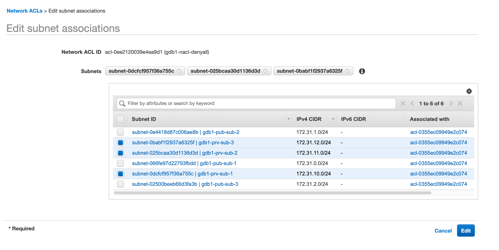
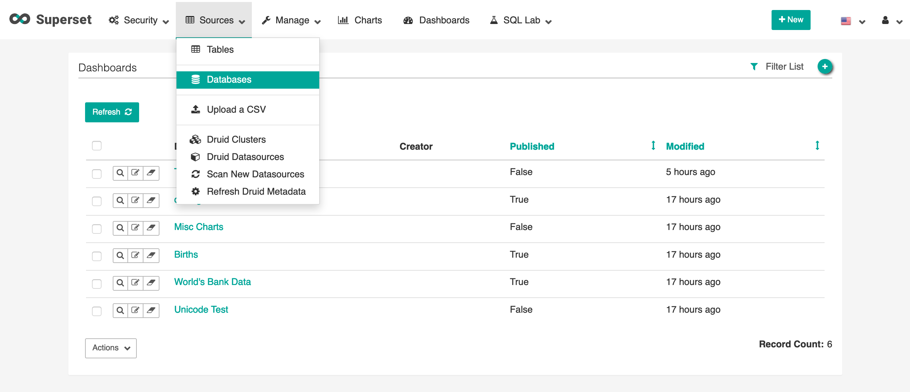

# Failover

This lab contains the following tasks:

## 6. Failover to the secondary region / simulate a regional failure and DR scenario

When used in combination with in-region replicas, an Aurora cluster gives you automatic failover capabilities within the region. With Aurora Global Database, you can perform a manual failover to the cluster in your secondary region, such that your database can survive in the unlikely scenario of an entire region's infrastructure or service becoming unavailable.

Combined with an application layer that is deployed cross-region (via immutable infrastructure or [copying your AMIs cross-region](https://docs.aws.amazon.com/AWSEC2/latest/UserGuide/CopyingAMIs.html)), you can further increase your applications' availability while maintaining data consistency.

#

### Creating a new table before simulating failover

>  **`Region 1 (Primary)`** 

1. First let us login to the Apache Superset interface again via the Primary Region instance URL.

1. On the Superset navigation menu, mouse over **SQL Lab** and then click on **SQL Editor**. 

1. Ensure that your selected **Database** is still set to ``mysql aurora-gdb1-write`` and the **Schema** set to ``mylab``. 

1. Copy and paste the following SQL query and click on **Run Query**

    ```
    DROP TABLE IF EXISTS mylab.failovertest1;

    CREATE TABLE mylab.failovertest1 (
        pk INT NOT NULL AUTO_INCREMENT, 
        gen_number INT NOT NULL,
        some_text VARCHAR(100),
        input_dt DATETIME,
        PRIMARY KEY (pk)
        ); 

    INSERT INTO mylab.failovertest1 (gen_number, some_text, input_dt) 
    VALUES (100,"region-1-input",now());
    COMMIT;

    SELECT * FROM mylab.failovertest1;
    ```

1. Note the query results.

### Failure Injection

Although we can simulate a failure with the Aurora-specific failure injection query ```ALTER SYSTEM CRASH;``` - we want to simulate a longer term and larger scale failure (however infrequent) and the best way to do this is to stop all ingress/egress data traffic in and out of the Aurora Global Database's primary DB cluster. The initial CloudFormation template created a NACL with specific DENY ALL traffic that will block all ingress/egress traffic out of the associated subnets.

>  **`Region 1 (Primary)`** 

1. In the AWS Management Console, ensure that you are working within your assigned primary region. Use the Service menu and click on **VPC** or simply type **VPC** into the search bar. This will bring up the Amazon VPC console.

1. Within the VPC console, scroll down on the left menu and select **Network ACLs**. This will bring you to the list of NACLs that are in your VPC. You should see **labstack-nacl-denyall** , and that it is not currently associated with any subnets.

    * Click on the **labstack-nacl-denyall** NACL, and review both the Inbound Rules and Outbound Rules. You should see that they're set to *DENY* for ALL traffic.

1. Click on **Actions** menu, and then select **Edit subnet associations**
  

1. As the Aurora Cluster is set to use the private subnets (governed by DB subnet group), all of which labeled with the prefix **labstack-prv-sub-X**, select all subnets that begin with that prefix description. Then click on the **Edit** button to confirm the associations. (Note: you may have to drag the first column wider to fully see the subnet names)
    

1. Once associated. Go back to your browser tab with your primary region's Apache Superset SQL Editor. Click on the :repeat: refresh button next to **Schema**.

1. You will notice that you can no longer access the primary cluster, and the schema refresh will eventually time out. We have successfully injected failure to render our Primary DB Cluster unreachable.

### Promote Secondary DB Cluster

As we are simulating a prolonged regional infrastructure or service level failure, in which point we will opt to perform a regional failover for our application and database stacks. We will take the next steps on promoting the secondary DB cluster to a regional master DB cluster.

>  **`Region 2 (Secondary)`** 

1. In the AWS Management Console, ensure that you are working within your assigned secondary region. Use the Service menu and click on **RDS** or simply type **RDS** into the search bar. This will bring up the Amazon RDS console.

1. Within the RDS console, select **Databases** on the left menu. This will bring you to the list of Databases already deployed. You should see **!gdbRegion2Cluster**  and **!gdbRegion2Instance** . 

    * Note: You might also notice that in your RDS console it will still report the primary region DB cluster and DB instance still as *healthy*, that is because we are simulating a failure by blocking all networking access via NACLs, and the blast radius of such a simulation is limited only to your AWS Account; the RDS/Aurora service and its internal health checks are provided by the service control plane itself and will still report the DB cluster and DB instance as healthy because there is no *real outage*.

1. Select the secondary DB Cluster. Click on the **Actions** menu, then select **Remove from Global**
    
    * A message will pop up asking you to confirm that this will break replication from the primary DB cluster. Confirm by clicking on **Remove and promote**.

1. The promote process should take less than 1 minute. Once complete, you should be able to see the previously secondary DB cluster is now labeled as **Regional** and the DB instance is now a **Writer** node.
    

1. Click on the newly promoted DB cluster. Under the **Connectivity and security** tab, the *Writer* endpoint should now be listed as *Available*. Copy and paste the endpoint string into your notepad as we prepare for failover on the application stack and adding this endpoint as the new writer.  
    

### Restore Application Write Access

>  **`Region 2 (Secondary)`** 

1. Log in to the Secondary Region instance of Apache Superset. Use the **Apache Superset Secondary URL** from your notes in the previous step.

1. In the Apache Superset navigation menu, mouse over **SQL Lab**, then click on **SQL Editor**.

1. Ensure that your selected **Database** is still set to ``mysql aurora-gdb2-read`` and the **Schema** set to ``mylab``. 

1. Copy and paste the following SQL query and click on **Run Query**

    ```
    SELECT * FROM mylab.failovertest1;
    ```

1. Note the query results, this should return the new table and record we entered into the Database shortly before the simulated failure.

1. Let's try to insert a new record to this table. Copy and paste the following DML query and click on **Run Query** - what do you expect the results to be?

    ```
    INSERT INTO mylab.failovertest1 (gen_number, some_text, input_dt) 
    VALUES (200,"region-2-input",now());
    COMMIT;

    SELECT * FROM mylab.failovertest1;    
    ```

1. Remember our secondary region Apache Superset instance previously utilized the specific Reader endpoint for the Global Database cluster, and the Writer endpoint was previously unavailable as a Secondary DB Cluster. As this database backend is now promoted to a writer, we can add a new datasource using the new writer endpoint to allow this instance of Apache Superset to serve write requests.

   1. In the Apache Superset navigation menu, mouse over **Sources**, then click on **Databases**.
      

   1. Near the top right, click on the green  :heavy_plus_sign: icon to add a new database source.

   1. Change the below values and press **Save** when done:

      Field | Value and Description
      ----- | -----
      Database | <pre>aurora-gdb2-write</pre> <br> This will be the friendly name of our Aurora Database in Superset<br>&nbsp;
      SQLAlchemy URI | <pre>mysql://masteruser:<b>auroragdb321</b>@<b><i>[Replace with Secondary Writer Endpoint]</i></b>/mysql</pre> <br> Replace the endpoint with the Secondary Writer Endpoint we have gathered previously. The password to connect to the database should remain as ```auroragdb321``` unless you have changed this value during CloudFormation deployment. Click on **Test Connection** to confirm.<br>&nbsp;
      Expose in SQL Lab | :ballot_box_with_check: (Checked)
      Allow CREATE TABLE AS | :ballot_box_with_check: (Checked)
      Allow DML | :ballot_box_with_check: (Checked)

      

1. Return to SQL Editor. Copy and paste the following DML query again and click on **Run Query** 

    ```
    INSERT INTO mylab.failovertest1 (gen_number, some_text, input_dt) 
    VALUES (200,"region-2-input",now());
    COMMIT;

    SELECT * FROM mylab.failovertest1;    
    ```

1. (!Cleanup) You should notice both your previous results before failover and the new record. Your application is now serving both read and write queries and serve your users as normal, during a region-wide disruption!

## Checkpoint

You have just performed a failover operation of your application from its primary region to secondary, during a simulated regional infrastructure or service level disruption. This allows you to build reliable applications serving your customers anywhere in the world that can be resilient and maintain its uptime in the face of a catastrophic disaster.


* In a real world scenario, you might want to front load your application tier with an application load balancer. Should you want to have seamless transition for your endpoint that handles write DML queries, you can also combine your applications with Route53 Active-Passive failover. These configurations are outside the scope of this particular workshop, but you can find more information on such architecture on AWS website:
    * DNS Failover Types with Route53: https://docs.aws.amazon.com/Route53/latest/DeveloperGuide/dns-failover-types.html#dns-failover-types-active-passive
    * Creating Route53 DNS Health Check: https://aws.amazon.com/premiumsupport/knowledge-center/route-53-dns-health-checks/
    * AWS This is my Architecture series - Multi-Region High-Availability Architecture: https://www.youtube.com/watch?v=vGywoYc_sA8

If you are up for another challenge, go to the optional step of [Failback](../failback/index.md).

Otherwise, proceed to wrap-up.