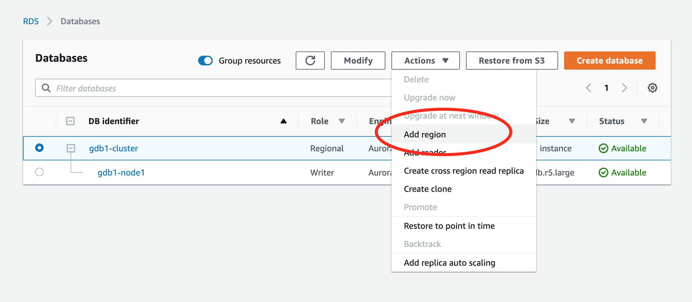
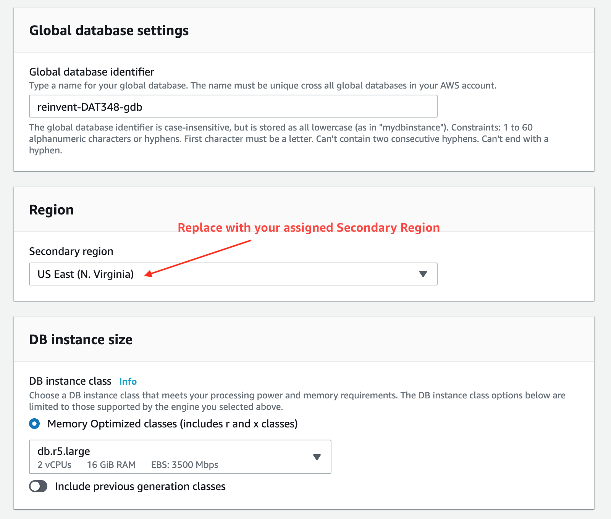
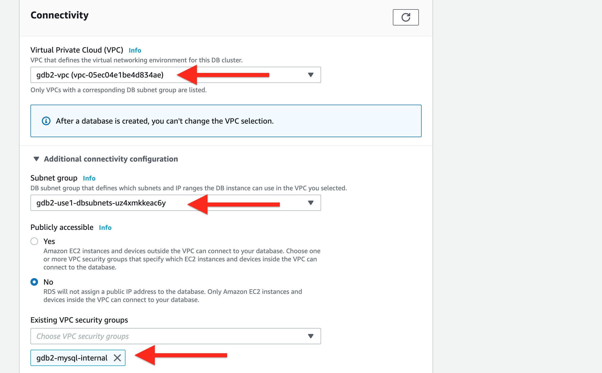
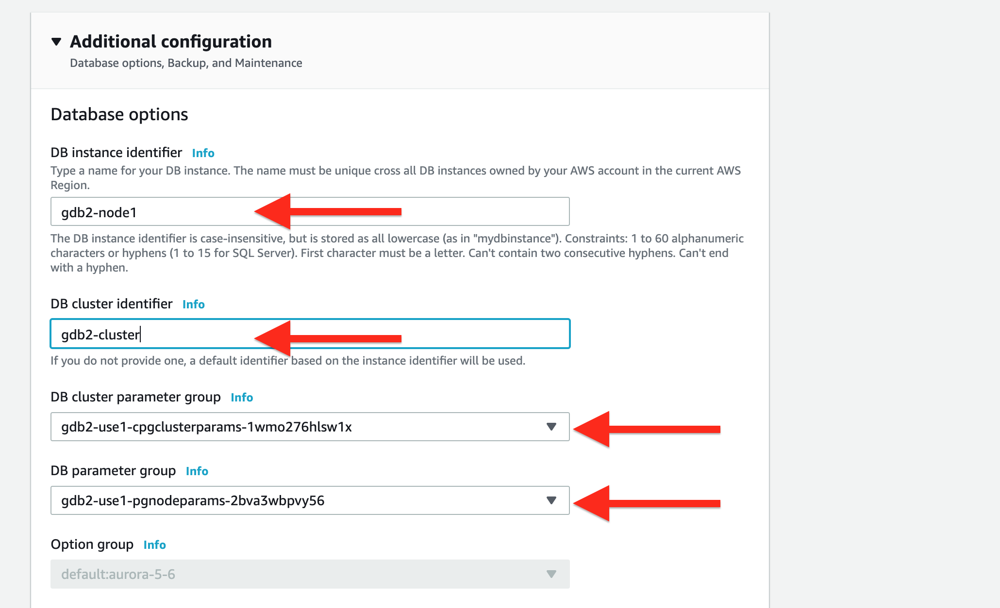
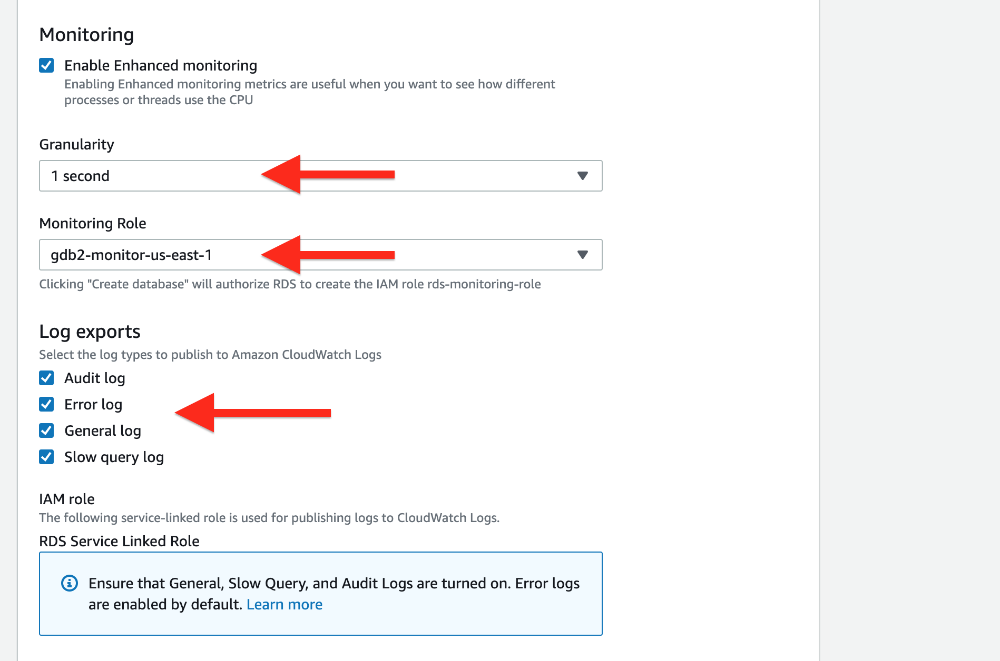
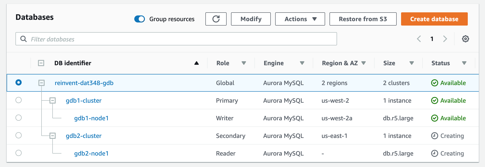
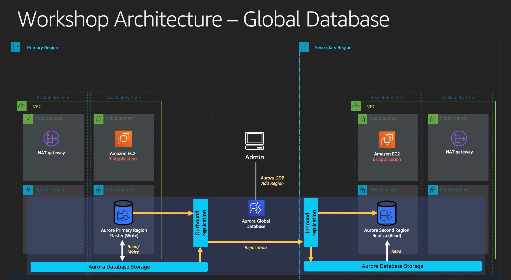

# Create Global Database

This lab contains the following tasks:

## 2. Create Aurora Global Database from existing Aurora DB cluster

For the sake of time, in the previous CloudFormation scripts, we have automatically launched an Aurora MySQL cluster in the primary region whose version is ready and compatible with Aurora Global Database. We will now create a Global Database which will span across multiple regions.

Definitions - expand for a refresher

An **Amazon Aurora Global Database** consists of one primary AWS Region where your data is mastered by the Primary Aurora DB cluster's Primary DB Instance for read and write operations, and one (or more) secondary AWS Region(s) where data is replicated to with typical latency of under a second. Applications with a worldwide footprint can use reader instances in the secondary AWS Region for low latency reads. In the unlikely event your database becomes degraded or isolated in the primary AWS region, you can promote the secondary AWS Region to take full read-write workloads in under a minute.

An **Amazon Aurora DB cluster** is a regional logical construct that consists of one or more DB instances and a cluster volume that manages the data for those DB instances.

An **Amazon Aurora Primary DB Instance** supports read and write operations, and performs all of the data modifications to the cluster volume. Each Aurora DB cluster has one primary DB instance. 

An **Amazon Aurora Replica** supports only read operations, connects to the same Aurora Storage Engine volume as the Primary DB Instance. High availability can be achieved by locating Aurora Replicas in separate Availability Zones, in which Aurora will automatically perform failover in the event the primary DB Instance becomes unavailable.

#

### Global Database - Add Region

>  **`Region 1 (Primary)`** 

1. In the AWS Management Console, ensure that you are working within your assigned primary region. Using the Service menu, click on or type to search for **RDS**. This will bring up the Amazon RDS console.

1. Within the RDS console, select **Databases** on the left menu. This will bring you to the list of Databases already deployed. You should see **gdb1-cluster** and **gdb1-node1**. 

1. Select **gdb1-cluster**. Click on the **Actions** menu, and select **Add Region**.

    

1. You are now creating an Aurora Global Database, adding a new region DB cluster to be replicated from your primary region's Aurora DB cluster.

   1. Under **Global database identifier**. We will name our Global database as ``reinvent-dat348-gdb``

   1. For **Secondary Region**, use the drop down list and select your assigned secondary region **`Region 2 (Secondary)`**. This can take a few seconds to load.

   1. Next, we have **DB Instance Class**. Aurora allows replicas and Global Database instances to be of different instance class and size. We will leave this as the default ``db.r5.large``.
     

   1. For **Multi-AZ deployment**, we will leave this as the default value ``Don't create an Aurora Replica``. For production, it is highly recommended to scale your read traffic to multiple reader nodes for even higher availability.

   1. For **Virtual Private Cloud**, we will click on the drop down list, and select ``gdb2-vpc``. This is the dedicated VPC we created from CloudFormation for the secondary region.

   1. Expand on **Additional connectivity configuration** for more options.

   1. Under **Existing VPC security groups**, we will click on the drop down list, deselect ``default`` and select ``gdb2-mysql-internal``. Attaching this security group allows our applications in the secondary region to reach the Aurora secondary DB Cluster.
     

   1. Leave the other default options, scroll down to bottom of the page and expand on **Additional configuration**.

   1. For **DB instance identifier**, we will name the Aurora DB instance for the secondary region. Let's name this ``gdb2-node1``

   1. Similarly, under **DB cluster identifier**, we will name the Aurora DB cluster for the secondary region. Let's name this ``gdb2-cluster``
   
   1. Ensure the **DB cluster parameter group** and **DB parameter groups** are set to the ones with the ``gdb2-`` prefix.
     

   1. Near the bottom, under **Monitoring**, Enable Enhanced Monitoring. We will vend metrics down to ``1-second`` **Granularity**. Click on the drop-down menu and change **Monitoring Role** to the IAM role you have under ``gdb2-monitor-<xx-region-x>`` name.
   
   1. For **Log exports**, we will enable and publish all log types to centralize and gather them into Amazon CloudWatch Logs.
     

   1. **Please validate all your settings**, anything that's not explicitly called out in the instructions here can be left on the default values. Remember, some database settings and configurations are immutable after creation. Let's confirm carefully that we have everything in order before pressing the **Add Region** button.

1. You will then be returned to the main RDS console and see that the Aurora DB Cluster and DB Instance in your secondary region is being provisioned. This will take about 15 minutes and the Secondary DB cluster and new DB instance reader will report as *Available*. You can move on to the next step while this is still being created.
  

#

### Checkpoint

At this point, you have created the Global Database, expanded the Aurora DB cluster from your primary region to replicate data over to the secondary region.

Proceed to the next step to [Connect Applications](../biapp/index.md).