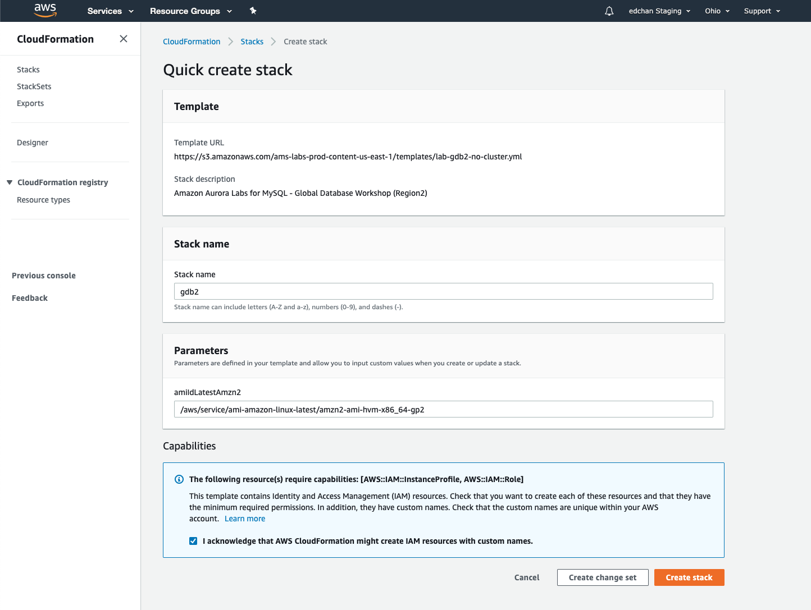
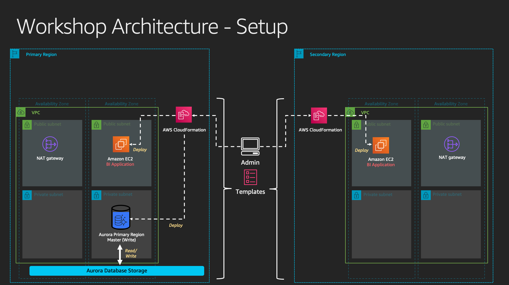

# Setup - Creating a Multi-Region workshop environment using AWS CloudFormation

To simplify the getting started experience with the labs, we have created foundational templates for <a href="https://aws.amazon.com/cloudformation/" target="_blank">AWS CloudFormation</a> that provisions the resources needed for the lab environment. The template is designed to deploy a consistent networking infrastructure, and client-side experience of software packages and components used in the workshop.

## Workshop Setup - Primary Region

If you are at re:Invent or an AWS public event, you are likely provided a 12-digit team code that gives access to a temporary AWS account dedicated for this workshop. If that is the case, the accounts already have the infrastructure in the assigned primary region pre-deployed.

> **`Region 1 (Primary)`**

* In the AWS Management Console, ensure that you are working within your assigned primary region. Using the Service menu, click on or type to search for **CloudFormation**. This will bring up the Amazon CloudFormation console.

* On the next screen, click on the stack with the Description *Amazon Aurora Labs - Global Database Workshop (Region 1)*, you should see that the status shows *CREATE_COMPLETE*.

* Click on the **Outputs** tab. The values here will be critical to the completion of the remainder of the lab.  Please take a moment to save these values somewhere that you will have easy access to them during the remainder of the lab. The names that appear in the **Key** column are referenced directly in the instructions in subsequent steps, using the parameter value format: ``=[outputKey]=``

* This confirms that we have resources ready in the primary region. We can skip steps below and go directly to **Workshop Setup - Secondary Region**.

<b>Manual Deployment for Primary Region (expand only for testing or if Stack was missing)</b>

If this is for AWS staff testing, or if you do not have the stack auto-deployed in your primary region. <a href="manual-cfn1.md">Click here for instructions for manual deployment.</a>

## Workshop Setup - Secondary Region

On the upper right corner of the AWS Console, click on your existing secondary region name and switch over to the secondary region that is assigned to you.

> **`Region 2 (Secondary)`**

| Region 2 | Region 2 Location | Deploy |
| --- | --- | --- |
| us-east-1 | N. Virginia |   |
| us-east-2 | Ohio |  |
| us-west-2 | Oregon |  |

Choose the region above matching your assigned secondary region to deploy the workshop environment. You can also download the [lab-gdb2-no-cluster.yml](/templates/lab-gdb2-no-cluster.yml) template and manually upload it to CloudFormation in your secondary region.

**Important**: Remember your primary and secondary region should be different. Refer back to the regions that has been assigned to you if you forget.

The desired template should be filled under **Template URL**. In the field named **Stack Name**, enter the value `gdb2`.

Scroll to the bottom, check the box that reads: **I acknowledge that AWS CloudFormation might create IAM resources with custom names** and then click **Create stack**.

In about 2-3 minutes, the status of the stack will change to `CREATE_COMPLETE`, click on the **Outputs** tab. The values here will be critical to the completion of the remainder of the lab.  Please take a moment to save these values somewhere that you will have easy access to them during the remainder of the lab. The names that appear in the **Key** column are referenced directly in the instructions in subsequent steps, using the parameter value format: `=[outputKey]=`

## Checkpoint

At this point, you should have the base resources provisioned in the following:

> **`Region 1 (Primary)`**

* Basic VPC with public and private subnets across 3 availability zones; security groups and NAT Gateway
* VPC NACLs (for failure injection)
* Amazon EC2 Instance with Apache Superset (Our BI Application)
* Amazon Aurora Regional Cluster
* Amazon RDS DB subnet group for Aurora

> **`Region 2 (Secondary)`**

* Basic VPC with public and private subnets across 3 availability zones; security groups and NAT Gateway
* Amazon EC2 Instance with Apache Superset (Our BI Application)
* Amazon RDS DB subnet group for Aurora

You should now have also gathered the CloudFormation **Outputs** values from both regions. Below is an architectural representation of the resources that has been deployed so far.

