# Deploying an Aurora Global Database

Amazon Aurora <a href="https://docs.aws.amazon.com/AmazonRDS/latest/AuroraUserGuide/aurora-global-database.html" target="_blank">Global Database</a> is designed for globally distributed applications, allowing a single Amazon Aurora database to span multiple AWS regions. It replicates your data with no impact on database performance, enables fast local reads with low latency in each region, and provides disaster recovery from region-wide outages.

This lab contains the following tasks:

1. Create a lab environment in a different region
2. Generate load on your DB cluster
3. Create an Aurora Global cluster
4. Monitor cluster load and replication lag
5. Promote the secondary region
6. Cleanup lab resources

This lab requires the following prerequisites:

* [Get Started](/win/)
* [Connect to your Aurora MySQL DB cluster](/win/ams-connect/)


## 1. Create a lab environment in a different region

To simplify the getting started experience with the labs, we have created foundational templates for <a href="https://aws.amazon.com/cloudformation/" target="_blank">AWS CloudFormation</a> that provision the resources needed for the lab environment. These templates are designed to deploy a consistent networking infrastructure, and client-side experience of software packages and components used in the lab.

Click **Launch Stack** below to provision a lab environment in the **N Virginia (us-east-1)** region to support the Aurora Global Database.

<a href="https://console.aws.amazon.com/cloudformation/home?region=us-east-1#/stacks/create/review?stackName=auroralab&templateURL=https://s3.amazonaws.com/[[bucket]]/templates/lab_secondary.yml&param_deployCluster=No&param_deployML=No" target="_blank"></a>

In the field named **Stack Name**, ensure the value `auroralab` is preset. Accept all default values for the remaining parameters.

Scroll to the bottom of the page, check the box that reads: **I acknowledge that AWS CloudFormation might create IAM resources with custom names** and then click **Create stack**.

<span class="image"></span>

The stack will take approximatively 10 minutes to provision, you can monitor the status on the **Stack detail** page. You can monitor the progress of the stack creation process by refreshing the **Events** tab. The latest event in the list will indicate `CREATE_COMPLETE` for the stack resource.

<span class="image"></span>

Once the status of the stack is `CREATE_COMPLETE`, click on the **Outputs** tab. The values here will be critical to the completion of the remainder of the lab.  Please take a moment to save these values somewhere that you will have easy access to them during the remainder of the lab. The names that appear in the **Key** column are referenced directly in the instructions in subsequent steps, using the parameter format: ==[outputKey]==.

<span class="image"></span>


## 2. Generate load on your DB cluster

While the second region is being built up, you will use Percona's TPCC-like benchmark script based on sysbench to generate load on the DB cluster in the existing region. For simplicity we have packaged the correct set of commands in an <a href="https://docs.aws.amazon.com/systems-manager/latest/userguide/sysman-ssm-docs.html" target="_blank">AWS Systems Manager Command Document</a>. You will use <a href="https://docs.aws.amazon.com/systems-manager/latest/userguide/execute-remote-commands.html" target="_blank">AWS Systems Manager Run Command</a> to execute the test. The load generator will run for approximatively one hour.

!!! note
    You will need to run the command in the **primary region**, not the region used for step 1. Create a lab environment in a different region.

If you are not already connected to the Session Manager workstation command line, please connect [following these instructions](/win/ams-connect/). Once connected, enter one of the following commands, replacing the placeholders appropriately.

```shell
aws ssm send-command \
--document-name [mysqlRunDoc] \
--instance-ids [bastionMySQL]
```

??? tip "What do all these parameters mean?"
    Parameter | Description
    --- | ---
    --document-name | The name of the command document to run on your behalf.
    --instance-ids | The EC2 instance to execute this command on.

The command will be sent to the workstation EC2 instance which will prepare the test data set and run the load test. It may take up to a minute for CloudWatch to reflect the additional load in the metrics. You will see a confirmation that the command has been initiated.


## 3. Create an Aurora Global cluster

The lab environment that was provisioned automatically for you, already has an Aurora MySQL DB cluster, that you are running the load generator against. You will create a Global Database cluster using this existing DB cluster, as the **primary**.

???+ info "'Global cluster' vs. 'DB cluster': What is the difference?"
    A **DB cluster** exists in one region only. It is a container for up to 16 **DB instances** that share the same storage volume. This is the traditional configuration of an Aurora cluster. Whether you are deploying a provisioned, Serverless or Multi-Master cluster, you are deploying a **DB cluster**, within a single region.

    A **Global [database] cluster** is a container for several **DB clusters** each located in a different region, that act as a cohesive database. A **global cluster** is comprised of a **primary [DB] cluster** in one given region that is able to accept writes, and up to 5 **secondary [DB] clusters** that are read-only each in a different region. Each one of the **DB clusters** in a given **global cluster** have their own storage volume, however data is replicated from the **primary cluster** to each of the **secondary clusters** asynchronously, using a purpose-built low latency and high throughput replication system.  

Once the lab environment created above at **Step 1. Create a lab environment in a different region** has finished deploying, you may proceed.

Open the <a href="https://eu-west-1.console.aws.amazon.com/rds/home?region=eu-west-1#database:id=auroralab-mysql-cluster;is-cluster=true" target="_blank">Amazon RDS service console</a> at the MySQL DB cluster details page in the **primary** region. If you navigated to the RDS console by means other than the link in this paragraph, click on the `auroralab-mysql-cluster` in the **Databases** section of the RDS service console, and make sure you are back in the primary regions.

From the **Actions** dropdown button, choose **Add region**.

<span class="image"></span>

On the setup screen, under **Global database settings**, set the **Global database identifier** to `auroralab-mysql-global`. Under **Region**, choose the **Secondary region** of `US East (N. Virginia)`.

In the **Connectivity** section, expand the sub-section called **Additional connectivity configuration**. This section allows you to specify where the database cluster will be deployed within your defined network configuration created above.

Pick the **Virtual Private Cloud (VPC)** named `auroralab-vpc`. Similarly make sure the selected **Subnet Group** also matches the stack name (e.g. `auroralab-dbsubnets-[hash]`). Make sure the cluster **Publicly accessible** option is set to **No**. The lab environment also configured a **VPC security group** that allows your lab workspace EC2 instance to connect to the database. Make sure the **Choose existing** security group option is selected and from the dropdown pick the security group named `auroralab-mysql-internal`. Please remove any other security groups, such as `default` from the selection.

Next, expand the **Advanced configuration** section. Set the **DB instance identifier** to `auroralab-mysql-node-3` and the **DB cluster identifier** to `auroralab-mysql-secondary`. For the **DB cluster parameter group** and **DB parameter group** selectors, choose the groups with the stack name in their name (e.g. `auroralab-[...]`).

Keep the `1 day` **Backup retention period**. Check the box to **Enable Performance Insights** with a **Retention period** of `Default (7 days)` and use the `[default] aws/rds` **Master key** for monitoring data encryption. Next, check the **Enable Enhanced Monitoring** box, select a **Granularity** of `1 second` and select the **Monitoring Role** value `auroralab-monitor-us-east-1`.

!!! note
    Please note there are **two** monitoring roles in the list, one for the primary region (the one in the top right corner of your web page), the other for the secondary region (typically `us-east-1`). At this step, you need the **secondary** region one.

<span class="image"></span>

??? tip "What do these selections mean?"
    You will create a global cluster, a secondary DB cluster, and DB instance in that secondary cluster, with associated configurations in one step. Your existing DB cluster will become the primary DB cluster in the new global cluster. These are distinct API calls to the RDS service should you create a global cluster using the AWS CLI, SDKs or other tools. The RDS service console, simply combines these distinct steps into a single operation.

Click **Add region** to provision the global cluster.

!!! note
    Creating a global cluster based on the existing DB cluster is a seamless operation, your workload will not experience any disruption. You can monitor the performance metrics of the load generator started above, throughout this operation to validate.

The global cluster, including the secondary DB cluster and instance may take up to 30 minutes to provision.

???+ tip "While you wait..."
    While you wait for the secondary DB cluster to provision, consider moving ahead and trying out the [Aurora Serverless labs](/win/ams-srvless-create/). You can always come back, when the secondary cluster finished deploying.

In order to connect to the DB cluster and start using it, you need to retrieve the DB cluster endpoints. Unlike a regular DB cluster, only the **Reader Endpoint** is provisioned. The **Cluster Endpoint** is not being provisioned, as secondary DB clusters only contain readers, and cannot accept writes. The **Reader Endpoint** will always resolve to one of the reader DB instances and should be used for low latency read operations within that region. In the RDS console, go to the DB cluster detail view by clicking on the cluster DB identifier for the secondary DB cluster, named `auroralab-mysql-secondary`.

The **Endpoints** section in the **Connectivity and security** tab of the details page displays the endpoints. Note these values down, as you will use them later.

<span class="image"></span>


## 4. Monitor cluster load and replication lag

Since the new **primary DB cluster** was in-use before you created the Global cluster using it, you can review the performance metrics of the cluster. In the RDS service console, select the `auroralab-mysql-cluster` (primary), if it is not already selected and toggle to the **Monitoring** tab. You will see a combined view of both the writer and reader DB instances in that cluster. You are not using the reader at this time, the load is directed only to the writer. Navigate through the metrics, and specifically review the **CPU Utilization**, **Commit Throughput**, **DML Throughput**, **Select Throughput** metrics, and notice they are fairly stable, beyond the initial spike caused by the sysbench tool populating an initial data set.

<span class="image"></span>

Next you will shift focus to the newly created **secondary DB cluster**. You will create a CloudWatch Dashboard to monitor three key metrics relevant to global clusters, and secondary DB clusters more specifically:

CloudWatch Metric Name | Description
----- | -----
`AuroraGlobalDBReplicatedWriteIO` | The number of Write IO replicated to the secondary region
`AuroraGlobalDBDataTransferBytes` | The amount of redo logs transferred to the secondary region, in bytes
`AuroraGlobalDBReplicationLag` | How far behind, measured in milliseconds, the secondary region lags behind the writer in the primary region

!!! warning "Region Check"
    You are going to work in a different region in the subsequent steps: N. Virginia (us-east-1). As you have multiple browser tabs and command line sessions open, please make sure you are always operating in the intended region.

Open the <a href="https://console.aws.amazon.com/cloudwatch/home?region=us-east-1#dashboards:" target="_blank">Amazon CloudWatch service console</a> in the secondary region at the **Dashboards** feature.

<span class="image"></span>

Click **Create dashboard**. Let's name our new dashboard `auroralab-gdb-dashboard` and click on the **Create dashboard** button again.

<span class="image">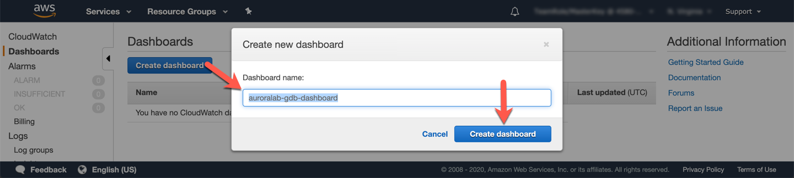</span>

Let's add our first widget on the dashboard that will show our replication latency between the secondary and primary Aurora cluster. Select **Number** and then click on **Configure**.

<span class="image">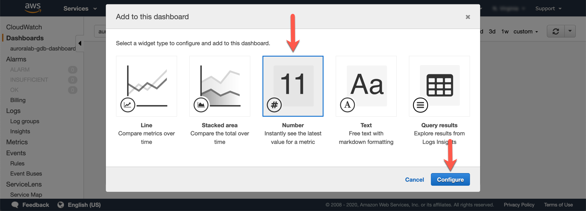</span>

In the **Add Metric Graph** screen, we will look under the **All Metrics** tab, and select **RDS**, and then select the metrics group named **SourceRegion**.

You should now see a filtered Metric Name `AuroraGlobalDBReplicationLag`, with the SourceRegion column as the name of your primary region of the global cluster. Select this metric using the checkbox.

The widget preview should now be on top with a sample of the lag time in milliseconds. Let's further update the widget. Give it a friendly name by clicking on the edit icon (pencil icon) and rename the widget from `Untitled Graph` to `Global DB Replication Lag (avg, 1min)`, press the tick/check icon to submit your changes.

On the bottom, click on the **Graph Metrics** tab to further customize our view. Under the **Statistic** column, we want to change this to `Average` and **Period** to `1 Minute`.

Confirm your settings are similar to the example below, and then click **Create widget**.

<span class="image">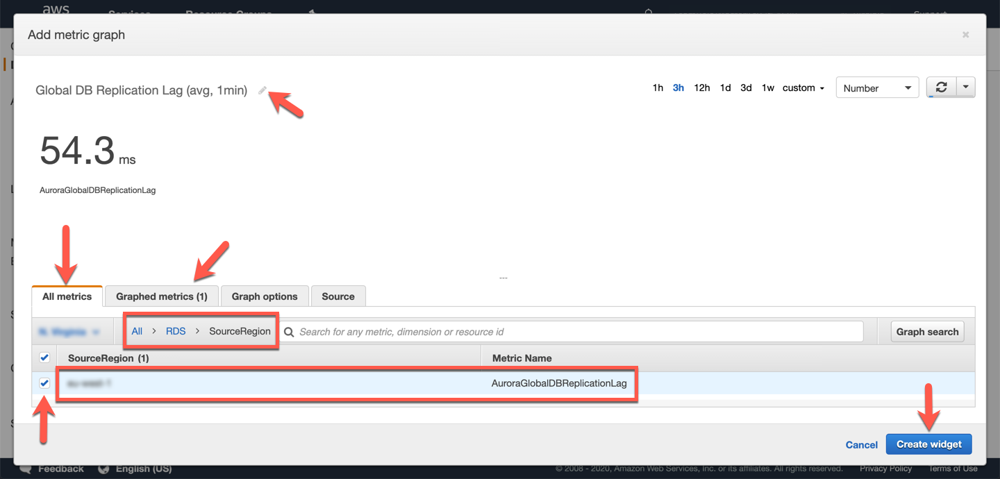</span>

Now you have created your first widget. You can set this to Auto refresh on a set interval on the top right refresh menu.

Click **Save dashboard** to save your changes.

<span class="image">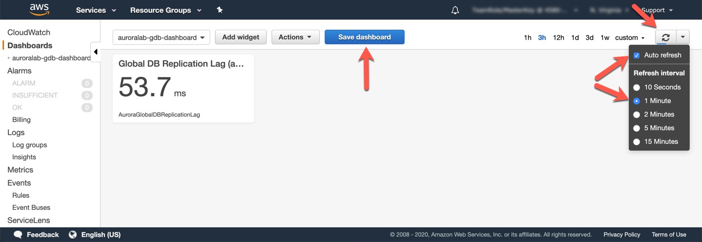</span>

You can add widgets individually to the dashboard, to build a more complete monitoring dashboard. However, to save some time you will simply update the source of the dashboard with the below JSON specification.

First, click the **Actions** dropdown on the dashboard, and choose **View/edit source**.

<span class="image">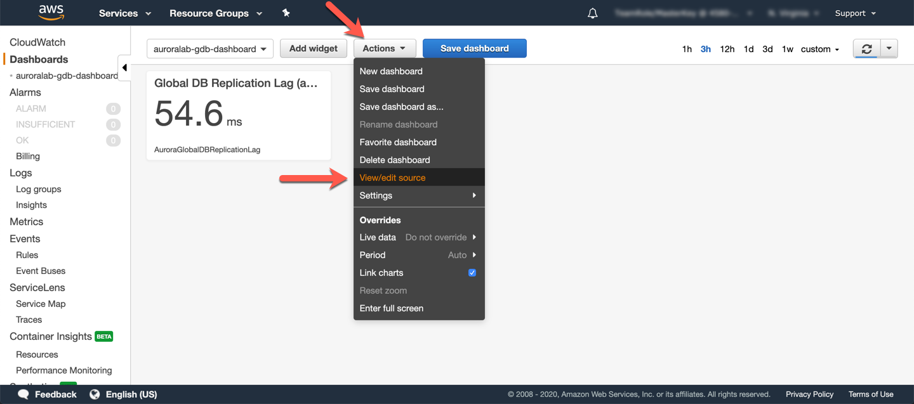</span>

In the textbox that appears on the screen, paste the following JSON code. Be sure to update the correct AWS regions, corresponding to your primary and secondary DB clusters, if needed in the code below. Also, if you used different DB cluster identifiers (names) for the DB clusters than the ones indicated in this guide, you will have to update those as well.

```json
{
    "widgets": [
        {
            "type": "metric",
            "x": 0,
            "y": 0,
            "width": 6,
            "height": 6,
            "properties": {
                "metrics": [
                    [ "AWS/RDS", "AuroraGlobalDBReplicationLag", "SourceRegion", "eu-west-1" ]
                ],
                "view": "singleValue",
                "region": "us-east-1",
                "stat": "Average",
                "period": 60,
                "title": "Global DB Replication Lag (avg, 1min)"
            }
        },
        {
            "type": "metric",
            "x": 6,
            "y": 0,
            "width": 18,
            "height": 6,
            "properties": {
                "metrics": [
                    [ "AWS/RDS", "AuroraGlobalDBReplicationLag", "SourceRegion", "eu-west-1" ],
                    [ "...", { "stat": "Maximum" } ]
                ],
                "view": "timeSeries",
                "stacked": false,
                "region": "us-east-1",
                "title": "Global DB Replication Lag (max vs. avg, 1min)",
                "stat": "Average",
                "period": 60
            }
        }
    ]
}
```

Click **Update** to change the dashboard.

<span class="image"></span>

Click **Save dashboard** to make sure the dashboard is saved with the new changes.

<span class="image">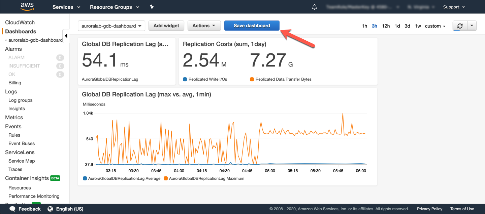</span>


## 5. Promote the secondary region

In the event of a DR condition where you application in the primary region is impaired, either due to application reasons (e.g. bad deployment), or infrastructure reasons, you can fail over operations to the secondary cluster. You can promote the secondary cluster to be an independent writable and readable DB cluster. Doing so allows you to continue operations in the DR region and discontinues replication from the old primary DB cluster in the other region. This operation has no dependency on the old primary region, such that you can perform it even if the old primary region is unavailable.

??? tip "Failovers and replica promotion in Aurora"
    Aurora supports automated failovers only within a single DB cluster, inside a single region. DB instances within a cluster share the same storage volume, therefore an automated failover results in not loss of committed data, only data changes produced by in-flight transactions will be lost. This is consistent with ACID requirements of a relational database.

    Once you promote a Global Database secondary DB cluster, it is removed from the global cluster and becomes a stand-alone regional DB cluster. In a DR scenario, or DR testing scenario, you may want to eventually fail-back your application to the original region. Once promoted you cannot, add the new DB cluster back to the old global cluster as a secondary region. Restarting or reversing the flow of replication is not supported. Failing back to the original region, requires you create a new global database, based on the newly promoted DB cluster, adding a secondary DB cluster in the original region for it, promoting that secondary DB cluster, and repeating the process to create a new secondary in the DR region again.

Next you will promote the secondary region to a stand alone DB cluster.

Open the <a href="https://console.aws.amazon.com/rds/home?region=us-east-1#database:id=auroralab-mysql-secondary;is-cluster=true" target="_blank">Amazon RDS service console</a> in the secondary region (N. Virginia) at the secondary DB cluster details page.

From the **Actions** dropdown button, choose **Remove from Global**.

<span class="image">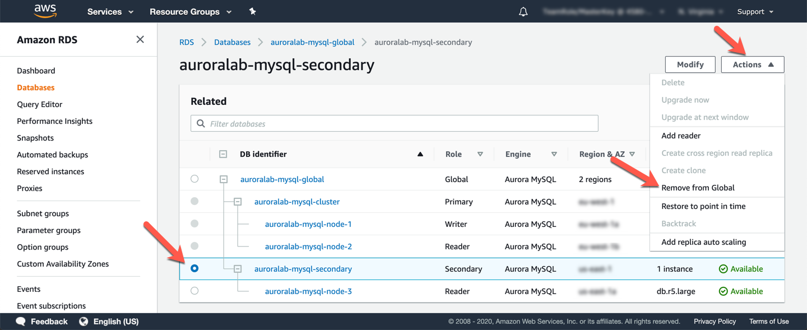</span>

Confirm at the prompt that you wish to perform this operation, by clicking **Remove and promote**. The process can take up to a minute to complete.

<span class="image">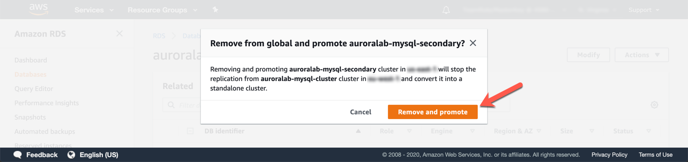</span>

Once completed, you will notice that the DB cluster `auroralab-mysql-secondary` is no longer part of the global cluster, and appears as an independent cluster with a **Regional** role. The single DB instance, member of this cluster has now a **Writer** role. At this point you can leverage this DB cluster for both reads and writes.

<span class="image">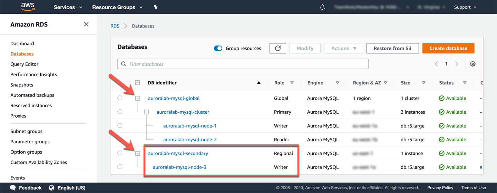</span>

## 6. Cleanup lab resources

By running this lab, you have created additional AWS resources. We recommend you run the commands below to remove these resources once you have completed this lab, to ensure you do not incur any unwanted charges for using these services.

With the RDS console of the secondary region open from above, select the DB instance of the newly promoted DB cluster, named `auroralab-mysql-node-3`. From the **Actions** dropdown button, choose **Delete**.

<span class="image">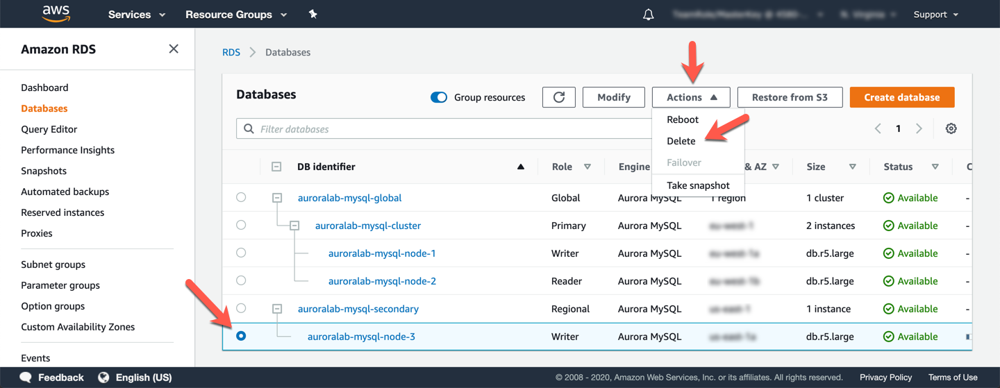</span>

**Uncheck** the checkbox next to **Create final snapshot?**. In a real life scenario, we recommend you create a final snapshot just in case you delete the DB cluster prematurely. However we will no longer need this DB cluster in this workshop.

**Check** the box next to **I acknowledge that upon instance deletion, automated backups, including system snapshots and point-in-time recovery, will no longer be available.**, and type `delete me` in the text box to confirm you want to delete the DB cluster. These steps are precautions to ensure customers do not delete resources accidentally.

<span class="image">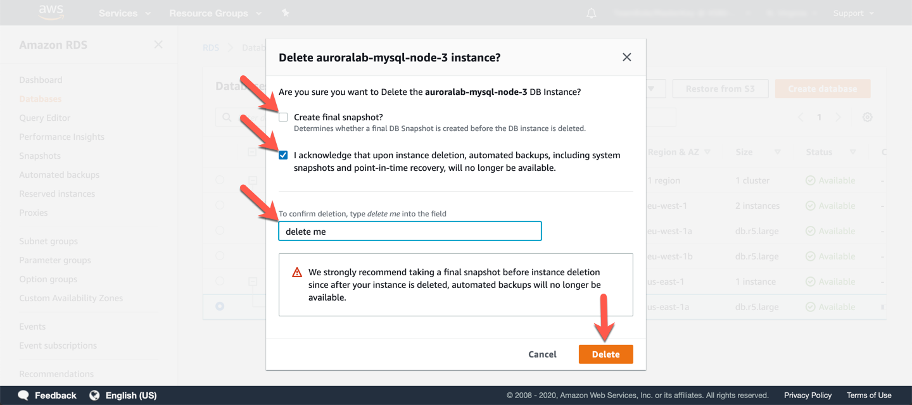</span>

Both the DB instance as well as the DB cluster will be deleted by this operation.

!!! note
    Unlike in the DB cluster cloning lab before, the RDS service console **combines both API calls** to delete the DB instance and to delete the DB cluster in a single operation, if you are deleting the last DB instance of a DB cluster.

Next, remove the primary DB cluster from the Global Database, following the same process like on step **5. Promote the secondary region**, only for the primary DB cluster (named `auroralab-mysql-cluster`), this time.

Once removed, please delete the now empty global cluster named `auroralab-mysql-global` by selecting it, and choosing **Delete** in the **Actions** dropdown.

<span class="image">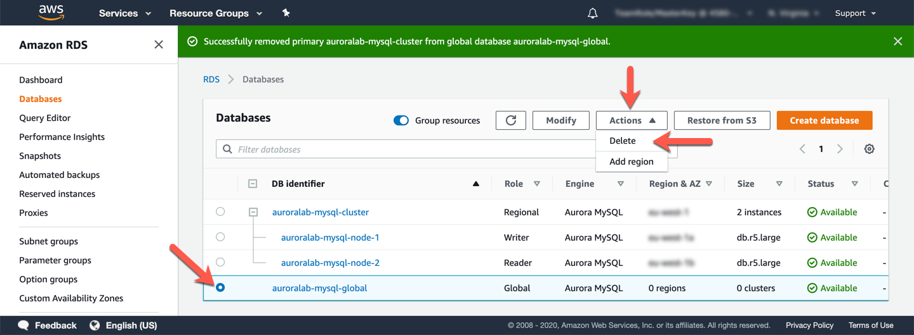</span>

Confirm the deletion request by typing `delete me` in the text box, and clicking **Delete**.
